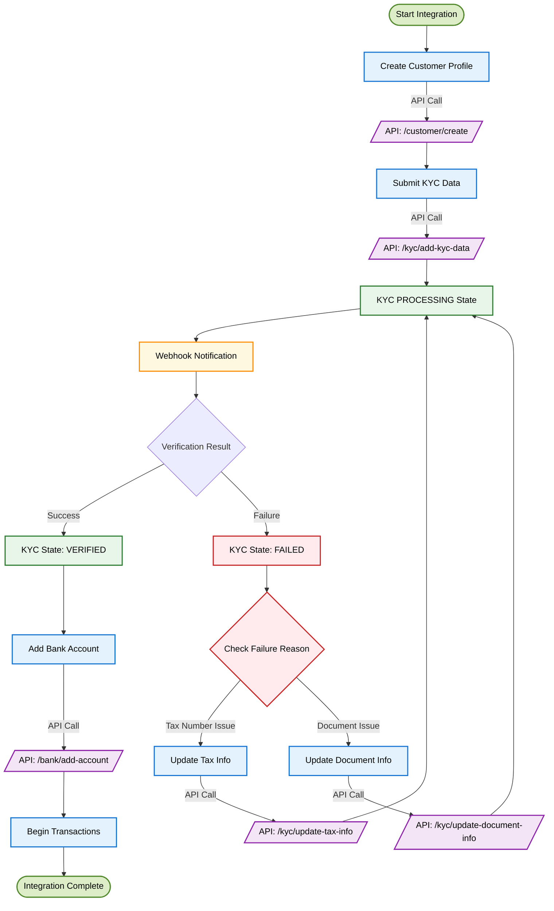
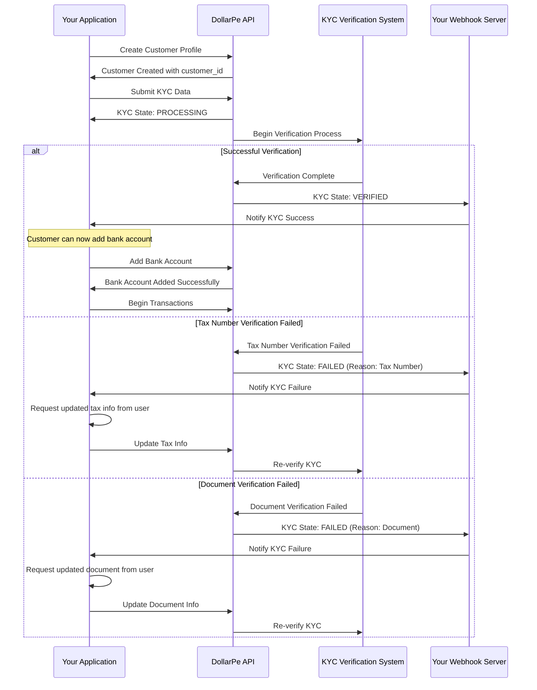

<Highlight>
  # KYC Integration Guide
</Highlight>

## What is KYC and Why It Matters

Know Your Customer (KYC) verification is an essential process that helps verify the identity of your users, prevent fraud, and comply with regulatory requirements. This guide will walk you through integrating DollarPe's KYC system into your application, whether you're a developer or a business owner.

<Note>
**Before You Begin:**
- Complete the [authentication setup](/guides/introduction) for API access
- Set up your [webhook endpoint](/api-reference-other/endpoint/webhook) to receive real-time KYC status updates
</Note>

## Integration at a Glance

The KYC integration follows these main steps:

1. Create a customer profile
2. Submit their KYC documents and information
3. Monitor verification status (usually completed in 5-120 minutes)
4. Handle any verification issues
5. Add bank account details once verified
6. Begin transactions

## Visual Integration Flow

### Process Flow Diagram



<Note>
**Processing Time**: KYC verification typically takes 60 seconds to 120 minutes to complete. Design your user experience accordingly.
</Note>

### Sequence Diagram: Detailed Process Flow



## Step-by-Step Integration Guide

### Step 1: Create a Customer Profile

First, register your customer in the system. This creates a unique customer ID that will be used throughout the KYC process.

<Tabs>
  <Tab title="API Request">
  ```javascript
  POST /customer/create
  {
    "client_reference_id": "cus_12345abcde", // optional
    "full_name": "JOHN DOE",
    "email": "john@example.com",
    "phone": "9911002211", // optional
    "alpha_3_country_code": "IND"
  }
  ```
  </Tab>
  
  <Tab title="Response">
  ```json
  {
    "status": true,
    "message": "Success",
    "data": {
        "id": "075986f3-282b-4555-bfcd-fad973e32596",
        "client_reference_id": "cus_12345abcde",
        "full_name": "JOHN DOE",
        "email": "john@example.com",
        "phone": "+919911002211",
        "country": "IND",
        "type": "INDIVIDUAL",
        "status": "UNVERIFIED"
    }
  }
  ```
  </Tab>
</Tabs>

**Key Fields:**
- `client_reference_id`: Unique reference ID generated by your system (optional)
- `full_name`: Customer's legal name
- `email`: Valid email address
- `phone`: Contact number
- `alpha_3_country_code`: Country code (e.g., "IND" for India)

<Note>
Save the returned `customer_id` as you'll need it for all subsequent API calls.
</Note>

### Step 2: Submit KYC Information

Once the customer profile is created, collect and submit their KYC details.

<Warning>
**Document Requirements:**
- Clear, high-resolution images
- All document text must be legible
- Supported document types: AADHAAR, PASSPORT, VOTER_ID, DRIVING_LICENSE
- Make sure the customer's face is clearly visible in photo ID
</Warning>

<Tabs>
  <Tab title="API Request">
  ```javascript
  POST /kyc/add-kyc-data
  {
    "customer_id": "075986f3-282b-4555-bfcd-fad973e32596",
    "full_name": "John Doe",
    "phone": "9911002211", // optional
    "full_address": "123 Main St, City",
    "dob": "01-01-1990",
    "registered_date": "01-01-2025",
    "tax_number": "ABCDE1234F", // optional
    "document_type": "AADHAAR",
    "document_front_image_url": "https://...",
    "document_back_image_url": "https://...",
    "document_details": {
      "document_number": "123456789012",
      "additional_data": {}
    },
    "selfie_url": "https://...",
    "selfie_verification_status": true
  }
  ```
  </Tab>
  
  <Tab title="Response">
  ```json
  {
    "status": true,
    "message": "Success",
    "data": {
        "customer_id": "075986f3-282b-4555-bfcd-fad973e32596",
        "status": "PROCESSING"
    }
  }
  ```
  </Tab>
</Tabs>

**Key Fields:**
- `customer_id`: ID received from Step 1
- `full_address`: Complete residential address
- `dob`: Date of birth (format: DD-MM-YYYY)
- `registered_date`: Date on which the user registered with centralized exchange
- `tax_number`: PAN as applicable
- `document_type`: Type of ID document submitted
- `document_front_image_url` & `document_back_image_url`: Secure URLs to uploaded document images
- `document_number`: Aadhaar Number or Passport's File Number based on document_type
- `selfie_url`: Secure URL to uploaded selfie image
- `selfie_verification_status`: Status of the selfie verification

<Tip>
For best results, use a secure file upload service to store document images and provide the URLs to our API. Never send document images as base64 strings.
</Tip>

### Step 3: Track Verification Status

After submitting KYC data, our system begins the verification process, which typically takes between 5-120 minutes to complete. There are two ways to monitor this status:

<Note>
**Verification Timeframe**: Most verifications complete within 5-120 minutes. You should communicate this expected timeline to your users to set proper expectations.
</Note>

#### Option A: Webhook Integration (Recommended)

Webhooks provide real-time updates about KYC status changes. Configure your webhook endpoint to receive these notifications:

```javascript
// Sample webhook payload
{
  "type": "CUSTOMER",
  "id": "075986f3-282b-4555-bfcd-fad973e32596",
  "event": "VERIFIED", // or "FAILED"
  "failure_reason": null, // Contains failure reason if status is "FAILED"
  "timestamp": "2025-03-12T14:30:00Z"
}
```

#### Option B: Status Polling

If webhooks aren't feasible, you can periodically check the status using the customer endpoint:

<Tabs>
  <Tab title="API Request">
  ```javascript
  GET /customer/{customer_id}
  ```
  </Tab>
  
  <Tab title="Response">
  ```json
  {
    "status": true,
    "message": "Success",
    "data": {
        "id": "075986f3-282b-4555-bfcd-fad973e32596",
        "client_reference_id": "cus_12345abcde",
        "full_name": "JOHN DOE",
        "email": "john@example.com",
        "phone": "+919911002211",
        "country": "IND",
        "type": "INDIVIDUAL",
        "status": "UNVERIFIED",
        "failure_reason": null
    }
  }
  ```
  </Tab>
</Tabs>

<Tip>
If using the polling approach, we recommend checking no more frequently than once every 5 minutes to avoid API rate limits.
</Tip>

### Step 4: Handle Verification Issues

If verification fails, you'll need to update the specific information that caused the failure.

#### Scenario A: Tax Number Verification Failed

<Tabs>
  <Tab title="API Request">
  ```javascript
  POST /kyc/update-tax-info
  {
    "customer_id": "075986f3-282b-4555-bfcd-fad973e32596",
    "tax_number": "XYZAB1234C" // Corrected tax number
  }
  ```
  </Tab>
  
  <Tab title="Response">
  ```json
  {
    "status": true,
    "message": "Success",
    "data": {
        "customer_id": "075986f3-282b-4555-bfcd-fad973e32596",
        "status": "PROCESSING"
    }
  }
  ```
  </Tab>
</Tabs>

#### Scenario B: Document Verification Failed

<Tabs>
  <Tab title="API Request">
  ```javascript
  POST /kyc/update-document-info
  {
    "customer_id": "075986f3-282b-4555-bfcd-fad973e32596",
    "full_address": "123 Main St, Apt 4B, City", // Updated address
    "document_type": "AADHAAR",
    "document_front_image_url": "https://...", // New, clearer image
    "document_back_image_url": "https://...", // New, clearer image
    "document_details": {
      "document_number": "123456789012",
      "additional_data": {}
    }
  }
  ```
  </Tab>
  
  <Tab title="Response">
  ```json
  {
    "status": true,
    "message": "Success",
    "data": {
        "customer_id": "075986f3-282b-4555-bfcd-fad973e32596",
        "status": "PROCESSING"
    }
  }
  ```
  </Tab>
</Tabs>

<Tip>
Common verification failures include:
- Blurry or illegible document images
- Mismatched name between documents
- Incorrect tax number format
- Expired identification documents
</Tip>

### Step 5: Add Bank Account Details

Once KYC verification is successful, you can add the customer's bank account:

<Tabs>
  <Tab title="API Request">
  ```javascript
  POST /bank/add-account
  {
    "customer_id": "075986f3-282b-4555-bfcd-fad973e32596",
    "account_number": "123456789012",
    "ifsc": "ABC123456"
  }
  ```
  </Tab>
  
  <Tab title="Response">
  ```json
  {
    "status": true,
    "message": "Success",
    "data": {
      "id": "4e6f1b20-a73c-11ec-b909-0242ac120002",
      "customer_id": "075986f3-282b-4555-bfcd-fad973e32596",
      "account_number": "123456789012",
      "ifsc_code": "ABC123456",
      "vpa": null,
      "bank_account_type": "ACCOUNT_DETAILS",
      "bank_account_status": "VERIFIED"
    }
  }
  ```
  </Tab>
</Tabs>

<Note>
Instead of "account_number" and "ifsc", you can also pass "vpa" to add a UPI ID.
</Note>

### Step 6: Ready for Transactions

Once KYC is verified and bank details are added, the customer can start transacting. At this point, you can:

- Process crypto-to-fiat conversions (offramp)
- Process fiat-to-crypto conversions (onramp)
- Access all available payment methods

## Testing Your Integration

### Sandbox Environment

Before going live, test your integration thoroughly in our sandbox environment:

1. Use the base URL: `https://sandbox.dollarpe.xyz`
2. Create test customers on sandbox
3. Test both successful and failed verification scenarios

## Common Issues & Solutions

<Accordion title="Images Not Uploading Properly">
Ensure you're using HTTPS URLs from a reliable file storage service. Image files should be JPG or PNG format, under 5MB, with minimum resolution of 300 DPI.
</Accordion>

<Accordion title="Webhook Not Receiving Updates">
Check your webhook URL configuration and ensure your server is properly acknowledging webhook events with a 200 OK response.
</Accordion>

<Accordion title="Verification Taking Too Long">
Most verifications complete within 5-120 minutes. If it's taking longer, check the status via API polling. For delays exceeding 3 hours, contact [support team](mailto:support@dollarpe.xyz).
</Accordion>

<Accordion title="API Connection Issues">
Ensure you're using the correct base URL and your authentication headers are properly set up. Check our [authentication guide](/guides/introduction) for details.
</Accordion>

## Getting Help

If you encounter any issues with your KYC integration:

- Check our [API documentation](/api-reference-other) for detailed endpoint information
- Visit the [Troubleshooting Guide](/guides/troubleshooting) for common solutions
- Contact our [support team](mailto:support@dollarpe.xyz) with your customer_id and transaction logs

<Note>
Our support team is available 24/7 to help with integration issues. For urgent matters, use the in-app chat or call our technical support hotline.
</Note>