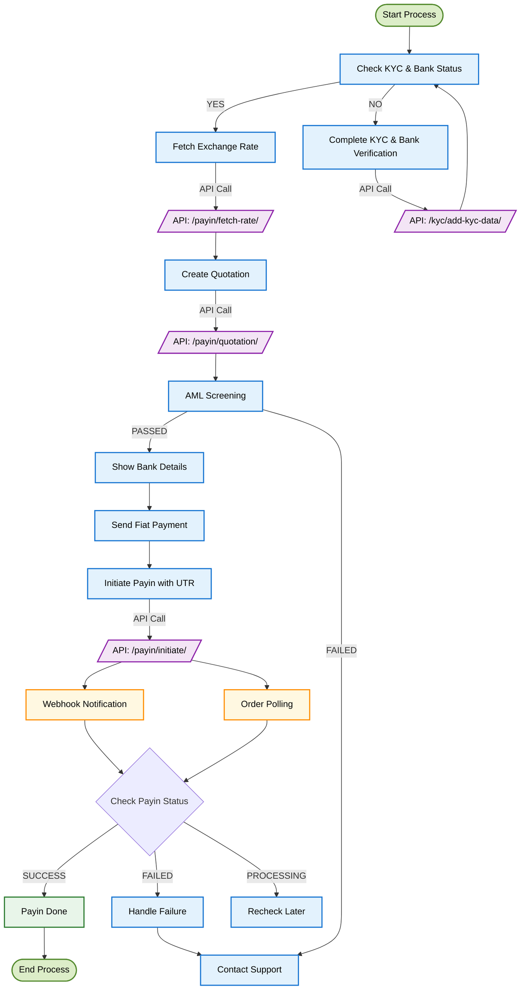
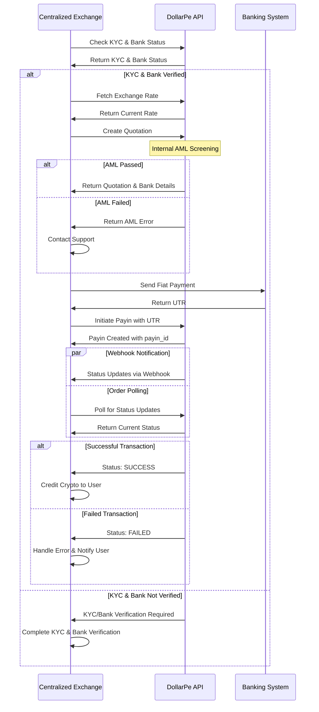

<Highlight># Payin Integration Guide</Highlight>

## What Are Payins and Why They Matter

Payins enable your application to seamlessly accept fiat payments from your customers' bank accounts, which will be converted to cryptocurrency. Whether you're a developer or a business owner, this guide will help you integrate DollarPe's Payin system.

<Note>
  **Prerequisites:** - Ensure you have completed the [authentication
  setup](/guides/authentication/authentication) - Configure your [webhook
  endpoint](/guides/webhook) for real-time updates - Review the
  following guides to ensure compatibility: - **[supported
  geographies](/guides/support/geographies)** - **[supported stablecoins and
  blockchains](/guides/support/stablecoins_and_blockchains)** - **[supported
  fiat methods](/guides/support/fiatMethods)** - Verify your users have
  completed KYC and have at least one verified bank account
</Note>

<Warning>
  **Warning**: Initiate the payin before the quotation expiry time.
</Warning>

## Integration at a Glance

The Payin integration flow for centralized exchanges involves the following key steps:

1. **Validate user requirements** – Ensure the customer has completed KYC verification and has at least one verified bank account added
2. **Fetch exchange rates** – Retrieve the latest cryptocurrency exchange rates
3. **Create a quotation** – Generate a quote for the desired payin amount
4. **Send fiat payment** – Transfer the fiat amount to the provided bank details
5. **Initiate the payin** – Start the payin using the UTR from the fiat payment
6. **Monitor transaction status** – Track the progress of the transaction
7. **Handle completion** – Finalize the payin once the transaction is confirmed

## Visual Integration Flow

### Process Flow Diagram



### Sequence Diagram: Detailed Process Flow



## Step-by-Step Integration Guide

### Step 1: Check Customer KYC and Bank Account status

Before initiating any payin, ensure the customer is KYC-verified and has a verified bank account.

<Tabs>
  <Tab title="Fetch Customer Info">
  ```javascript
  GET /customer/{customer_id}
  Response:
  {
    "status": true,
    "message": "Success",
    "data": {
      "id": "550e8400-e29b-41d4-a716-446655440000",
      "status": "VERIFIED",
      "full_name": "John Doe",
      "email": "john.doe@example.com",
      "phone": "+1234567890"
    }
  }
  ```
  </Tab>
  
  <Tab title="Fetch Bank Account Info">
  ```javascript
  GET /bank/list/{customer_id}
  {
    "status": true,
    "message": "Success",
    "data": {
      "count": 1,
      "next": null,
      "previous": "<url>",
      "results": [
        {
          "id": "4e6f1b20-a73c-11ec-b909-0242ac120002",
          "customer_id": "550e8400-e29b-41d4-a716-446655440000",
          "account_number": "123456789012",
          "ifsc_code": "ABC123456",
          "vpa": "testing@upi",
          "bank_account_type": "ACCOUNT_DETAILS",
          "bank_account_status": "VERIFIED"
        }
      ]
    }
  }
  ```
  </Tab>
</Tabs>

### Step 2: Fetch Exchange Rate

Get the real-time exchange rate for a given crypto asset.

<Tabs>
  <Tab title="API Request">
  ```javascript
  GET /payin/fetch-rate
  {
    "asset": "usdt",
    "fiat": "inr",
  }
  ```
  </Tab>
  
  <Tab title="Response">
  ```json
  {
    "status": true,
    "message": "Success",
    "data": {
      "asset": "USDT",
      "fiat": "INR",
      "rate": 87.2
    }
  }
  ```
  </Tab>
</Tabs>

**Key Fields:**

- `asset`: Cryptocurrency to be received (e.g., "USDT", "USDC")
- `fiat`: Fiat currency to send (e.g., "INR" for Indian Rupee)
- `rate`: Current exchange rate (amount of fiat per 1 unit of crypto)

<Tip>
  Rates fluctuate constantly based on market conditions. We recommend fetching a
  new rate before each transaction to ensure accuracy.
</Tip>

### Step 3: Create a Quotation

After getting the current rate, create a quotation to lock in the rate.

<Tabs>
  <Tab title="API Request">
  ```javascript
  POST /payin/quotation
  {
    "asset": "usdt",
    "fiat": "inr",
    "receiving_amount": "51",
    "customer_id": "def8b740-99f9-4cba-bc9e-99de57e927b4",
    "bank_account_id": "4e6f1b20-a73c-11ec-b909-0242ac120002"
  }
  ```
  </Tab>
  
  <Tab title="Response">
  ```json
  {
      "status": true,
      "message": "Success",
      "data": {
          "id": "c9f343b5-ff56-4d52-93af-0962f75242b7",
          "customer_id": "8da49e5e-33d1-48b2-b107-eb34f851b2fd",
          "bank_id": "c863b696-7fbd-4b16-b3a7-134aefffb2fe",
          "asset": "USDT",
          "fiat": "INR",
          "receiving_amount": 10,
          "rate": 87.2,
          "sending_amount": 858.96,
          "fees": {
              "client_fee_fiat": "",
              "client_fee_crypto": "",
              "dollarpe_fee": "",
              "pg_fee": "",
              "client_gst_fiat": "",
              "client_gst_crypto": "",
              "dollarpe_gst": "",
              "pg_gst": "",
              "tds": "",
              "gross_exchange_rate": ""
          },
          "bank_details": {
              "account_number": "123456789012",
              "ifsc_code": "ABC123456",
          },
          "created_at": "2025-03-21T13:29:07.828029Z",
          "expiry_time": "2025-03-21T13:39:07.828029Z"
      }
  }
  ```
  </Tab>
</Tabs>

**Key Fields:**

- `asset`: Cryptocurrency to be received
- `fiat`: Fiat currency to send (e.g., "INR" for Indian Rupee)
- `receiving_amount`: Amount in cryptocurrency to receive
- `customer_id`: ID of the KYC-verified customer
- `bank_id`: ID of the verified bank account
- `bank_details`: Bank account details for sending the fiat payment
- `expiry_time`: Time until the quotation expires

<Note>You must complete your transaction before this time expires.</Note>

### Step 4: Send Fiat Payment

Once you have the quotation and bank details, instruct the customer to send the fiat payment:

1. Use the provided bank account details to make the payment
2. Ensure the exact amount is sent as specified in the quotation
3. Keep the UTR (Unique Transaction Reference) from the bank
4. Complete the payment before the quotation expires

### Step 5: Initiate the Payin

After the fiat payment is completed, create a payin request with the UTR:

<Tabs>
  <Tab title="API Request">
  ```javascript
  POST /payin/initiate
  {
    "quotation_id": "2e104290-07c8-49f1-a5ca-0d27f0078f8a",
    "customer_id": "def8b740-99f9-4cba-bc9e-99de57e927b4",
    "client_reference_id": "testUser123",
    "utr": "UTR123456789"
  }
  ```
  </Tab>
  
  <Tab title="Response">
  ```json
  {
    "status": true,
    "message": "Success",
    "data": {
        "id": "ac7c5360-0b57-4fb7-88f2-df1c371930ee",
        "quotation_id": "c9f343b5-ff56-4d52-93af-0962f75242b7",
        "customer_id": "8da49e5e-33d1-48b2-b107-eb34f851b2fd",
        "client_reference_id": "payin_first_test",
        "bank_id": "c863b696-7fbd-4b16-b3a7-134aefffb2fe",
        "asset": "USDT",
        "fiat": "INR",
        "rate": 87.2,
        "receiving_amount": 10,
        "sending_amount": 858.96,
        "fees": {
            "client_fee_fiat": "",
            "client_fee_crypto": "",
            "dollarpe_fee": "",
            "pg_fee": "",
            "client_gst_fiat": "",
            "client_gst_crypto": "",
            "dollarpe_gst": "",
            "pg_gst": "",
            "tds": "",
            "gross_exchange_rate": ""
        },
        "utr": "UTR123456789",
        "created_at": "2025-03-21T13:37:53.208137Z",
        "status": "PROCESSING"
    }
  }
  ```
  </Tab>
</Tabs>

**Key Fields:**

- `quotation_id`: ID received from Step 3
- `customer_id`: ID of the KYC-verified customer
- `client_reference_id`: Your internal reference ID for tracking (optional)
- `bank_id`: ID of the verified bank account
- `utr`: Unique Transaction Reference from the bank payment
- `status`: Current status of the payin

### Step 6: Monitor Transaction Status

After initiating the payin, you need to track its status by polling the API:

<Tabs>
  <Tab title="API Request">
  ```javascript
  GET /payin/{payin_id}
  ```
  </Tab>
  
  <Tab title="Response">
  ```json
  {
    "status": true,
    "message": "Success",
    "data": {
        "id": "ac7c5360-0b57-4fb7-88f2-df1c371930ee",
        "quotation_id": "c9f343b5-ff56-4d52-93af-0962f75242b7",
        "customer_id": "8da49e5e-33d1-48b2-b107-eb34f851b2fd",
        "client_reference_id": "payin_first_test",
        "bank_id": "c863b696-7fbd-4b16-b3a7-134aefffb2fe",
        "asset": "USDT",
        "fiat": "INR",
        "receiving_amount": "10.00000000",
        "rate": "87.20000000",
        "sending_amount": "858.96000000",
        "fees": {
            "client_fee_fiat": "",
            "client_fee_crypto": "",
            "dollarpe_fee": "",
            "pg_fee": "",
            "client_gst_fiat": "",
            "client_gst_crypto": "",
            "dollarpe_gst": "",
            "pg_gst": "",
            "tds": "",
            "gross_exchange_rate": ""
        },
        "utr": "UTR123456789",
        "status": "PROCESSING",
        "failure_reason": "",
        "created_at": "2025-03-21T13:37:53.208137Z",
        "updated_at": "2025-03-21T13:37:53.208142Z"
    }
  }
  ```
  </Tab>
</Tabs>

**Possible Status Values:**

- `PROCESSING`: Initial state, waiting for fiat payment confirmation
- `SUCCESS`: Payin has been successfully completed
- `FAILED`: Payin has failed and failure_reason is updated

### Step 7: Handle Transaction Completion

#### Successful Transactions

When a payin is completed successfully:

1. Update your internal records with the transaction details
2. Credit the cryptocurrency to your user's account
3. Notify your user that the funds have been received
4. Store the transaction details for future reference and customer support

### Step 8: Link Exchange Order ID with Exchange Transfer ID

Upon successful payin, ensure the exchange transfer ID (associated with the sent cryptocurrency) is linked to the corresponding exchange order ID.

<Tabs>
  <Tab title="API Request">
  ```javascript
  PATCH /payout/update-transfer-id
  {
    "payin_id": "c9f343b5-ff56-4d52-93af-0962f75242b7",
    "exchange_transfer_id": "9282391023212"
  }
  ```
  </Tab>
  
  <Tab title="Response">
  ```json
  {
    "status": true,
    "message": "Success",
    "data": {
        "payin_id": "c9f343b5-ff56-4d52-93af-0962f75242b7",
        "exchange_transfer_id": "9282391023212"
    }
  }
  ```
  </Tab>
</Tabs>

## Testing Your Integration

### Sandbox Environment

Before going live, test your integration thoroughly in our sandbox environment:

1. Use the base URL: `https://sandbox-api.dollarpe.xyz`
2. Follow the same steps as production
3. Test both successful and failed transaction scenarios

<Tip>
  In the sandbox environment, you can simulate different failure scenarios by
  using specific test values. Refer to our [Sandbox Testing
  Guide](/guides/sandbox-testing) for details.
</Tip>

## Common Issues & Solutions

<Accordion title="Rate Changed Between Quotation and Transaction">
  Exchange rates are locked once you create a quotation. However, if your
  quotation expires, you'll need to create a new one with the current rate.
  Always check the expiry time and complete your transaction before it expires.
</Accordion>

<Accordion title="UTR Not Being Detected">
  Ensure you're using the correct UTR from the bank payment. The UTR should be
  exactly as provided by the bank. If the UTR is not being detected, verify it
  with your bank statement.
</Accordion>

<Accordion title="Funds Not Received by Customer">
  If the customer reports not receiving cryptocurrency, verify the payment
  details and check the transaction status. If the status shows as completed but
  funds haven't arrived, there might be a delay in the processing.
</Accordion>

<Accordion title="Payin Taking Too Long">
  Most payins complete within 30-60 minutes, but can take up to 24 hours during
  high volume periods or bank processing delays. If a payin is pending for more
  than 24 hours, contact our support team.
</Accordion>

## Getting Help

If you encounter any issues with your payin integration:

- Check our [API documentation](/api-reference) for detailed endpoint information
- Visit the [Troubleshooting Guide](/guides/troubleshooting) for common solutions
- Contact our [support team](mailto:support@dollarpe.xyz) with your customer_id and transaction logs

<Note>
  Our support team is available 24/7 to help with integration issues. For urgent
  matters, use the in-app chat or call our technical support hotline.
</Note>
