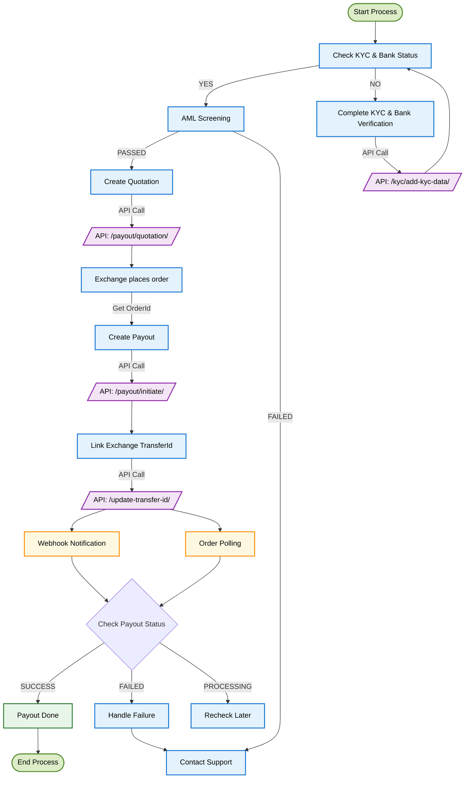
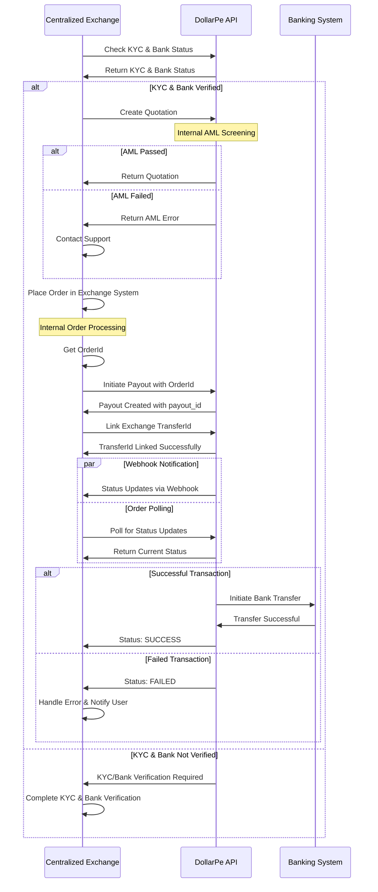

<Highlight># Payout Integration Guide</Highlight>

## What Are Payouts and Why They Matter

Payouts enable your application to seamlessly transfer funds to your customers' bank accounts, using cryptocurrency as the funding source. Whether you're a developer or a business owner, this guide will help you integrate DollarPe's Payout system.

<Note>
  **Prerequisites:** 
  - Ensure you have completed the [authentication setup](/guides/authentication/authentication) 
  - Configure your [webhook endpoint](/guides/webhook) for real-time updates 
  - Review the following guides to ensure compatibility: 
    - **[supported geographies](/guides/support/geographies)** 
    - **[supported stablecoins and blockchains](/guides/support/stablecoins_and_blockchains)** 
    - **[supported fiat methods](/guides/support/fiatMethods)** 
  - Verify your users have completed KYC and have at least one verified bank account
</Note>

<Warning>
  **Warning**: Initiate the payout before the quotation expiry time.
</Warning>

## Integration at a Glance

The Payout integration flow for centralized exchanges involves the following key steps:

1. **Validate user requirements** – Ensure the customer has completed KYC verification and has at least one verified bank account added
2. **Fetch exchange rates** – Retrieve the latest cryptocurrency exchange rates
3. **Create a quotation** – Generate a quote for the desired payout amount
4. **Place exchange order** – Place an order on your centralized exchange
5. **Initiate the payout** – Start the payout using the exchange order ID
6. **Link exchange transfer ID** - Link the exchange transfer ID with the payout
7. **Monitor transaction status** – Track the progress of the transaction
8. **Handle completion** – Finalize the payout once the transaction is confirmed

## Visual Integration Flow

### Process Flow Diagram



### Sequence Diagram: Detailed Process Flow



## Step-by-Step Integration Guide

### Step 1: Check Customer KYC and Bank Account status

Before initiating any payout, ensure the customer is KYC-verified and has a verified bank account.

<Tabs>
  <Tab title="Fetch Customer Info">
  ```javascript
  GET /customer/{customer_id}
  Response:
  {
    "status": true,
    "message": "Success",
    "data": {
      "id": "550e8400-e29b-41d4-a716-446655440000",
      "status": "VERIFIED",
      "full_name": "John Doe",
      "email": "john.doe@example.com",
      "phone": "+1234567890"
    }
  }
  ```
  </Tab>
  
  <Tab title="Fetch Bank Account Info">
  ```javascript
  GET /bank/list/{customer_id}
  {
    "status": true,
    "message": "Success",
    "data": {
      "count": 1,
      "next": null,
      "previous": "<url>",
      "results": [
        {
          "id": "4e6f1b20-a73c-11ec-b909-0242ac120002",
          "customer_id": "550e8400-e29b-41d4-a716-446655440000",
          "account_number": "123456789012",
          "ifsc_code": "ABC123456",
          "vpa": "testing@upi",
          "bank_account_type": "ACCOUNT_DETAILS",
          "bank_account_status": "VERIFIED"
        }
      ]
    }
  }
  ```
  </Tab>
</Tabs>

### Step 2: Fetch Exchange Rate

Get the real-time exchange rate for a given crypto asset.

<Tabs>
  <Tab title="API Request">
  ```javascript
  GET /payout/fetch-rate
  {
    "asset": "usdt",
    "fiat": "inr",
  }
  ```
  </Tab>
  
  <Tab title="Response">
  ```json
  {
    "status": true,
    "message": "Success",
    "data": {
      "asset": "USDT",
      "fiat": "INR",
      "rate": 87.2
    }
  }
  ```
  </Tab>
</Tabs>

**Key Fields:**

- `asset`: Cryptocurrency to be used (e.g., "USDT", "USDC")
- `amount`: Amount in cryptocurrency
- `rate`: Current exchange rate (amount of fiat per 1 unit of crypto)

<Tip>
  Rates fluctuate constantly based on market conditions. We recommend fetching a
  new rate before each transaction to ensure accuracy.
</Tip>

### Step 3: Create a Quotation

After getting the current rate, create a quotation to lock in the rate.

<Tabs>
  <Tab title="API Request">
  ```javascript
  POST /payout/quotation
  {
    "asset": "usdt",
    "fiat": "inr",
    "sending_amount": "51",
    "customer_id": "def8b740-99f9-4cba-bc9e-99de57e927b4",
    "bank_account_id": "4e6f1b20-a73c-11ec-b909-0242ac120002"
  }
  ```
  </Tab>
  
  <Tab title="Response">
  ```json
  {
      "status": true,
      "message": "Success",
      "data": {
          "id": "c9f343b5-ff56-4d52-93af-0962f75242b7",
          "customer_id": "8da49e5e-33d1-48b2-b107-eb34f851b2fd",
          "bank_id": "c863b696-7fbd-4b16-b3a7-134aefffb2fe",
          "asset": "USDT",
          "fiat": "INR",
          "sending_amount": 10,
          "rate": 87.2,
          "receiving_amount": 858.96,
          "fees": {
              "client_fee_fiat": "",
              "client_fee_crypto": "",
              "dollarpe_fee": "",
              "pg_fee": "",
              "client_gst_fiat": "",
              "client_gst_crypto": "",
              "dollarpe_gst": "",
              "pg_gst": "",
              "tds": "",
              "gross_exchange_rate": ""
          },
          "created_at": "2025-03-21T13:29:07.828029Z",
          "expiry_time": "2025-03-21T13:39:07.828029Z"
      }
  }
  ```
  </Tab>
</Tabs>

**Key Fields:**

- `asset`: Cryptocurrency to be used
- `fiat`: Fiat currency to receive (e.g., "INR" for Indian Rupee)
- `sending_amount`: Amount in cryptocurrency
- `customer_id`: ID of the KYC-verified customer
- `wallet_address`: Address to send funds to (MUST be whitelisted)
- `expiry_time`: Time until the quotation expires

<Note>You must complete your transaction before this time expires.</Note>

### Step 4: Place Exchange Order

Once you have the quotation, place an order on your centralized exchange. This order will be used to initiate the payout process.

### Step 5: Initiate the Payout

After placing an order on your centralized exchange, create a payout request with the exchange order ID:

<Tabs>
  <Tab title="API Request">
  ```javascript
  POST /payout/initiate
  {
    "quotation_id": "2e104290-07c8-49f1-a5ca-0d27f0078f8a",
    "customer_id": "def8b740-99f9-4cba-bc9e-99de57e927b4",
    "client_reference_id": "testUser123",
    "exchange_order_id": "898990982672892"
  }
  ```
  </Tab>
  
  <Tab title="Response">
  ```json
  {
    "status": true,
    "message": "Success",
    "data": {
        "id": "ac7c5360-0b57-4fb7-88f2-df1c371930ee",
        "quotation_id": "c9f343b5-ff56-4d52-93af-0962f75242b7",
        "customer_id": "8da49e5e-33d1-48b2-b107-eb34f851b2fd",
        "client_reference_id": "payout_first_test",
        "bank_id": "c863b696-7fbd-4b16-b3a7-134aefffb2fe",
        "asset": "USDT",
        "fiat": "INR",
        "rate": 87.2,
        "sending_amount": 10,
        "receiving_amount": 858.96,
        "fees": {
            "client_fee_fiat": "",
            "client_fee_crypto": "",
            "dollarpe_fee": "",
            "pg_fee": "",
            "client_gst_fiat": "",
            "client_gst_crypto": "",
            "dollarpe_gst": "",
            "pg_gst": "",
            "tds": "",
            "gross_exchange_rate": ""
        },
        "exchange_order_id": "898990982672892",
        "created_at": "2025-03-21T13:37:53.208137Z",
        "status": "PROCESSING"
    }
  }
  ```
  </Tab>
</Tabs>

**Key Fields:**

- `quotation_id`: ID received from Step 3
- `customer_id`: ID of the KYC-verified customer
- `client_reference_id`: Your internal reference ID for tracking (optional)
- `bank_id`: ID of the verified bank account
- `exchange_order_id`: ID of the order placed at the centralized exchange
- `status`: Current status of the payout

<Note>
  Most payouts are processed within 30-60 minutes, but can take up to 24 hours
  during high volume periods or in case of bank processing delays.
</Note>

### Step 6: Monitor Transaction Status

After initiating the payout, you need to track its status by polling the API:

<Tabs>
  <Tab title="API Request">
  ```javascript
  GET /payout/{payout_id}
  ```
  </Tab>
  
  <Tab title="Response">
  ```json
  {
    "status": true,
    "message": "Success",
    "data": {
        "id": "ac7c5360-0b57-4fb7-88f2-df1c371930ee",
        "quotation_id": "c9f343b5-ff56-4d52-93af-0962f75242b7",
        "customer_id": "8da49e5e-33d1-48b2-b107-eb34f851b2fd",
        "client_reference_id": "payout_first_test",
        "bank_id": "c863b696-7fbd-4b16-b3a7-134aefffb2fe",
        "asset": "USDT",
        "network": "BSC",
        "fiat": "INR",
        "sending_amount": "10.00000000",
        "rate": "87.20000000",
        "receiving_amount": "858.96000000",
        "fees": {
              "client_fee_fiat": "",
              "client_fee_crypto": "",
              "dollarpe_fee": "",
              "pg_fee": "",
              "client_gst_fiat": "",
              "client_gst_crypto": "",
              "dollarpe_gst": "",
              "pg_gst": "",
              "tds": "",
              "gross_exchange_rate": ""
          },
        "exchange_order_id": "",
        "status": "PROCESSING",
        "utr": null,
        "failure_reason": "",
        "created_at": "2025-03-21T13:37:53.208137Z",
        "updated_at": "2025-03-21T13:37:53.208142Z"
    }
  }
  ```
  </Tab>
</Tabs>

**Possible Status Values:**

- `PROCESSING`: Initial state, waiting for crypto confirmation
- `SUCCESS`: Payout has been successfully completed and UTR is generated
- `FAILED`: Payout has failed and failure_reason is updated

### Step 7: Handle Transaction Completion

#### Successful Transactions

When a payout is completed successfully:

1. Update your internal records with the transaction details
2. Notify your user that the funds have been sent to their bank account
3. Provide the bank reference number for their records (if available)
4. Store the transaction details for future reference and customer support

<Warning>
  If your transaction fails due to sending funds to the wrong address or
  network, recovery may not be possible. Always double-check these details
  before sending.
</Warning>

### Step 8: Link Exchange Order ID with Exchange Transfer ID

After the payout is successful, you must link the exchange transfer ID related to the crypto sent with the exchange order ID:

<Tabs>
  <Tab title="API Request">
  ```javascript
  PATCH /payout/update-transfer-id
  {
    "exchange_order_id": "92823910232129090",
    "exchange_transfer_id": "9282391023212"
  }
  ```
  </Tab>
  
  <Tab title="Response">
  ```json
  {
    "status": true,
    "message": "Success",
    "data": {
        "exchange_order_id": "92823910232129090",
        "exchange_transfer_id": "9282391023212"
    }
  }
  ```
  </Tab>
</Tabs>

**Key Fields:**

- `exchange_order_id`: The order ID from your centralized exchange
- `exchange_transfer_id`: The transfer ID associated with the crypto transaction

## Testing Your Integration

### Sandbox Environment

Before going live, test your integration thoroughly in our sandbox environment:

1. Use the base URL: `https://sandbox-api.dollarpe.xyz`
2. Follow the same steps as production
3. Test both successful and failed transaction scenarios

<Tip>
  In the sandbox environment, you can simulate different failure scenarios by
  using specific test values. Refer to our [Sandbox Testing
  Guide](/guides/sandbox-testing) for details.
</Tip>

## Common Issues & Solutions

<Accordion title="Rate Changed Between Quotation and Transaction">
  Exchange rates are locked once you create a quotation. However, if your
  quotation expires, you'll need to create a new one with the current rate.
  Always check the expiry time and complete your transaction before it expires.
</Accordion>

<Accordion title="Transaction Not Being Detected">
  Ensure you're using the correct transaction hash and that the transaction has
  sufficient blockchain confirmations. Most networks require at least 6-12
  confirmations before a transaction is considered final.
</Accordion>

<Accordion title="Funds Not Received by Customer">
  If the customer reports not receiving funds, verify the bank account details
  and check the transaction status. If the status shows as completed but funds
  haven't arrived, there might be a delay in the banking system.
</Accordion>

<Accordion title="Payout Taking Too Long">
  Most payouts complete within 30-60 minutes, but can take up to 24 hours during
  high volume periods or bank processing delays. If a payout is pending for more
  than 24 hours, contact our support team.
</Accordion>

## Getting Help

If you encounter any issues with your payout integration:

- Check our [API documentation](/api-reference) for detailed endpoint information
- Visit the [Troubleshooting Guide](/guides/troubleshooting) for common solutions
- Contact our [support team](mailto:support@dollarpe.xyz) with your customer_id and transaction logs

<Note>
  Our support team is available 24/7 to help with integration issues. For urgent
  matters, use the in-app chat or call our technical support hotline.
</Note>
