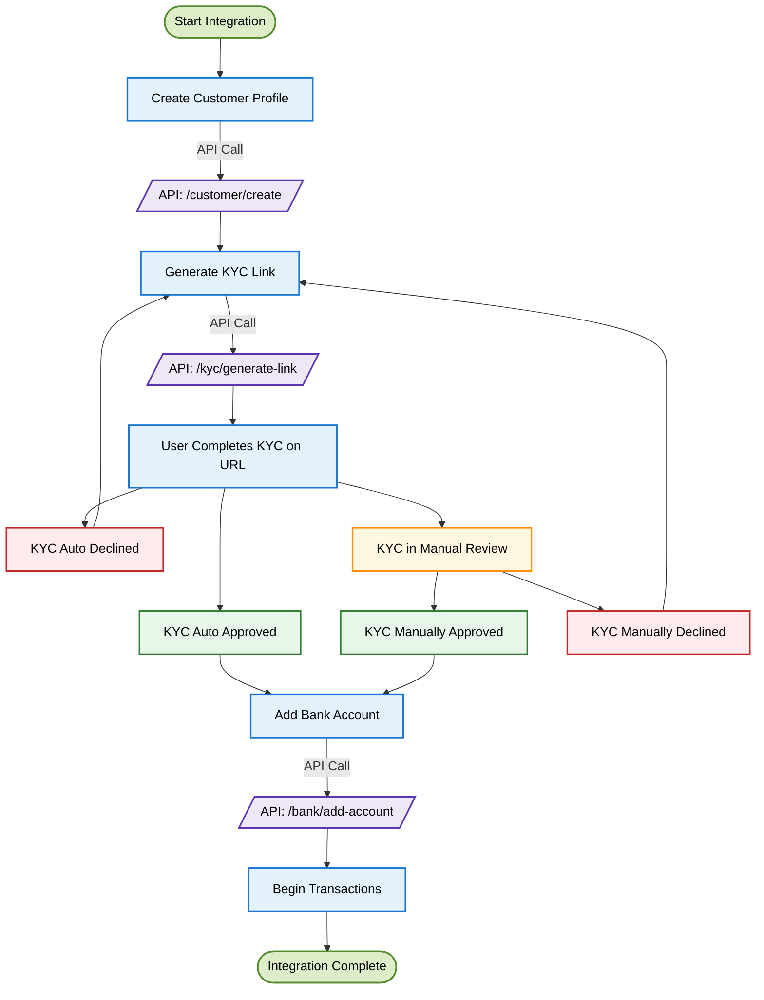

<Highlight>
  # KYC Integration Guide
</Highlight>

## What is KYC and Why It Matters

Know Your Customer (KYC) verification is an essential process that helps verify the identity of your users, prevent fraud, and comply with regulatory requirements. This guide will walk you through integrating DollarPe's KYC system into your application, whether you're a developer or a business owner.

<Note>
**Before You Begin:**
- Complete the [authentication setup](/guides/introduction) for API access
- Set up your [webhook endpoint](/api-reference-other/endpoint/webhook) to receive real-time KYC status updates
</Note>

## Integration at a Glance

The KYC integration follows these main steps:

1. Create a customer profile
2. Submit their KYC documents and information
3. Monitor verification status (usually completed in 60 seconds to 120 minutes)
4. Handle any verification issues
5. Add bank account details once verified
6. Begin transactions

## Visual Integration Flow

### Process Flow Diagram



<Note> **Processing Time**: KYC verification typically takes 60 seconds to 120 minutes to complete. Design your user experience accordingly. </Note>

## Step-by-Step Integration Guide

### Step 1: Create a Customer Profile

First, register your customer in the system. This creates a unique customer ID that will be used throughout the KYC process.

<Tabs>
  <Tab title="API Request">
  ```javascript
  POST /customer/create
  {
    "client_reference_id": "cus_12345abcde", // optional
    "full_name": "JOHN DOE",
    "email": "john@example.com",
    "phone": "9911002211", // optional
    "alpha_3_country_code": "IND"
  }
  ```
  </Tab>
  
  <Tab title="Response">
  ```json
  {
    "status": true,
    "message": "Success",
    "data": {
        "id": "075986f3-282b-4555-bfcd-fad973e32596",
        "client_reference_id": "cus_12345abcde",
        "full_name": "JOHN DOE",
        "email": "john@example.com",
        "phone": "+919911002211",
        "country": "IND",
        "type": "INDIVIDUAL",
        "status": "UNVERIFIED"
    }
  }
  ```
  </Tab>
</Tabs>

**Key Fields:**
- `client_reference_id`: Unique reference ID generated by your system (optional)
- `full_name`: Customer's legal name
- `email`: Valid email address
- `phone`: Contact number
- `alpha_3_country_code`: Country code (e.g., "IND" for India)

<Note>
Save the returned `customer_id` as you'll need it for all subsequent API calls.
</Note>

### Step 2: Generate KYC Link

Once the customer profile is created, generate their KYC Link

<Warning>
**Document Requirements:**
- Aadhaar / Passport
- PAN Number
</Warning>

<Tabs>
  <Tab title="API Request">
  ```javascript
  POST /kyc/generate-link
  {
    "customer_id": "075986f3-282b-4555-bfcd-fad973e32596",
    "redirect_url": "https://..."
  }
  ```
  </Tab>
  
  <Tab title="Response">
  ```json
  {
    "status": true,
    "message": "Success",
    "data": {
        "customer_id": "075986f3-282b-4555-bfcd-fad973e32596",
        "url": "https://..."
    }
  }
  ```
  </Tab>
</Tabs>

<Tip>
Additionally, if you're collecting the KYC data yourself, you can also explore the [KYC Sharing](/guides/kyc/kyc-sharing) method.
</Tip>

### Step 3: Track Verification Status

After submitting KYC data, our system begins the verification process, which typically takes between 60 seconds to 120 minutes to complete. There are two ways to monitor this status:

<Note>
**Verification Timeframe**: Most verifications complete within 60 seconds to 120 minutes. You should communicate this expected timeline to your users to set proper expectations.
</Note>

#### Option A: Webhook Integration (Recommended)

Webhooks provide real-time updates about KYC status changes. Configure your webhook endpoint to receive these notifications:

```javascript
// Sample webhook payload
{
  "type": "CUSTOMER",
  "event": "FAILED",
  "id": "12348400-e29b-41d4-a716-446655440000",
  "timestamp": "2024-03-13T10:00:00Z",
  "metadata": {
    "failure_reason": "TAX_VERIFICATION_FAILED"
  }
}
```

#### Option B: Status Polling

If webhooks aren't feasible, you can periodically check the status using the customer endpoint:

<Tabs>
  <Tab title="API Request">
  ```javascript
  GET /customer/{customer_id}
  ```
  </Tab>
  
  <Tab title="Response">
  ```json
  {
    "status": true,
    "message": "Success",
    "data": {
        "id": "075986f3-282b-4555-bfcd-fad973e32596",
        "client_reference_id": "cus_12345abcde",
        "full_name": "JOHN DOE",
        "email": "john@example.com",
        "phone": "+919911002211",
        "country": "IND",
        "type": "INDIVIDUAL",
        "status": "UNVERIFIED",
        "failure_reason": null,
        "is_edd_verified": false
    }
  }
  ```
  </Tab>
</Tabs>

<Tip>
If using the polling approach, we recommend checking no more frequently than once every 60 seconds to avoid API rate limits.
</Tip>

### Step 4: Handle Verification Issues

If verification fails, you'll need to re-generate the KYC link and prompt the user to submit their KYC again.

### Step 5: Add Bank Account Details

Once KYC verification is successful, you can add the customer's bank account:

<Tabs>
  <Tab title="API Request">
  ```javascript
  POST /bank/add-account
  {
    "customer_id": "075986f3-282b-4555-bfcd-fad973e32596",
    "account_number": "123456789012",
    "ifsc": "ABC123456"
  }
  ```
  </Tab>
  
  <Tab title="Response">
  ```json
  {
    "status": true,
    "message": "Success",
    "data": {
      "id": "4e6f1b20-a73c-11ec-b909-0242ac120002",
      "customer_id": "075986f3-282b-4555-bfcd-fad973e32596",
      "account_number": "123456789012",
      "ifsc_code": "ABC123456",
      "vpa": null,
      "bank_account_type": "ACCOUNT_DETAILS",
      "bank_account_status": "VERIFIED"
    }
  }
  ```
  </Tab>
</Tabs>

<Note>
Instead of "account_number" and "ifsc", you can also pass "vpa" to add a UPI ID.
</Note>

### Step 6: Ready for Transactions

Once KYC is verified and bank details are added, the customer can start transacting. At this point, you can:

- Process crypto-to-fiat conversions (offramp)
- Process fiat-to-crypto conversions (onramp)
- Access all available payment methods

## Testing Your Integration

### Sandbox Environment

Before going live, test your integration thoroughly in our sandbox environment:

1. Use the base URL: `https://sandbox.dollarpe.xyz`
2. Create test customers on sandbox
3. Test both successful and failed verification scenarios

## Getting Help

If you encounter any issues with your KYC integration:

- Check our [API documentation](/api-reference-other) for detailed endpoint information
- Visit the [Troubleshooting Guide](/guides/troubleshooting) for common solutions
- Contact our [support team](mailto:support@dollarpe.xyz) with your customer_id and transaction logs

<Note>
Our support team is available 24/7 to help with integration issues. For urgent matters, use the in-app chat or call our technical support hotline.
</Note>