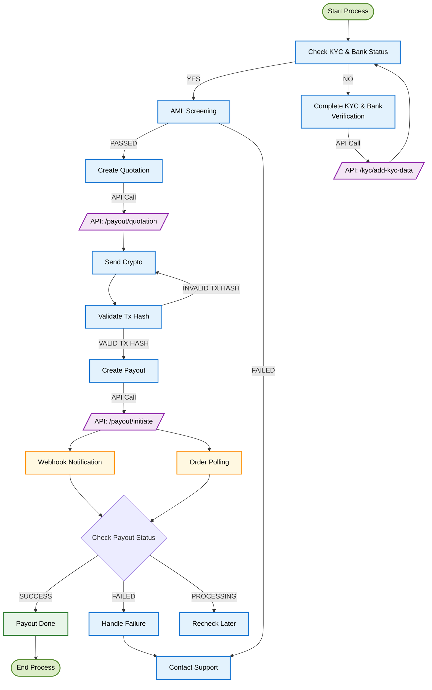
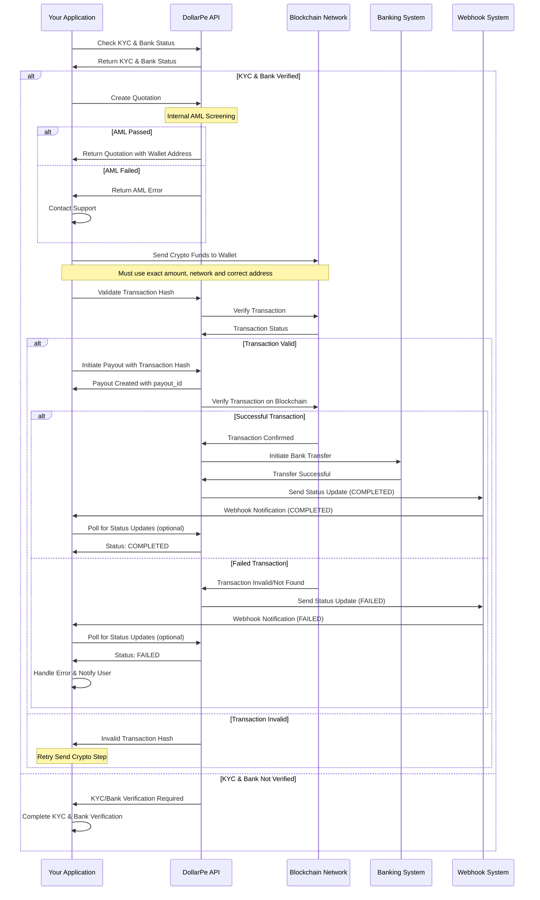

<Highlight># Payout Integration Guide</Highlight>

## What Are Payouts and Why They Matter

Payouts enable your application to seamlessly transfer funds to your customers' bank accounts, using cryptocurrency as the funding source. Whether you're a developer or a business owner, this guide will help you integrate DollarPe's Payout system.

<Note>
  **Prerequisites:** 
  - Ensure you have completed the [authentication setup](/guides/authentication/authentication) 
  - Configure your [webhook endpoint](/guides/webhook) for real-time updates 
  - Review the following guides to ensure compatibility: 
    - **[supported geographies](/guides/support/geographies)** 
    - **[supported stablecoins and blockchains](/guides/support/stablecoins_and_blockchains)** 
    - **[supported fiat methods](/guides/support/fiatMethods)** 
  - Verify your users have completed KYC and have at least one verified bank account
</Note>

<Warning>
  **Warning**: Send funds and initiate the payout before the quotation expiry
  time.
</Warning>

## Integration at a Glance

The Payout integration flow for **[Other Applications]** involves the following key steps:

- **Validate user requirements** – Ensure the customer has completed KYC verification and has at least one verified bank account added
- **Fetch exchange rates** – Retrieve the latest cryptocurrency exchange rates
- **Create a quotation** – Generate a quote for the desired payout amount
- **Send cryptocurrency** – Transfer crypto to the provided wallet address
- **Initiate the payout** – Start the payout using the transaction hash of the sent funds
- **Monitor transaction status** – Track the progress of the transaction
- **Handle completion** – Finalize the payout once the transaction is confirmed

## Visual Integration Flow

### Process Flow Diagram



### Sequence Diagram: Detailed Process Flow



## Step-by-Step Integration Guide

### Step 1: Fetch Configurations

Before starting the integration, fetch the basic configuration to understand supported assets, networks, and limits:

<Tabs>
  <Tab title="API Request">
  ```javascript
  GET /payout/configuration
  ```
  </Tab>
  
  <Tab title="Response">
  ```json
  {
    "status": true,
    "message": "Success",
    "data": {
        "supported_fiats": [
            "inr"
        ],
        "supported_assets": [
            "usdt",
            "usdc"
        ],
        "supported_networks": [
            "polygon",
            "eth",
            "bsc",
            "sepolia",
            "solana",
            "tron",
            "arbitrum"
        ],
        "coin_limits": {
            "usdt": {
                "polygon": {
                    "min": 30,
                    "max": 5855
                },
                "eth": {
                    "min": 30,
                    "max": 5855
                },
                "bsc": {
                    "min": 30,
                    "max": 5855
                },
                "sepolia": {
                    "min": 30,
                    "max": 5855
                },
                "solana": {
                    "min": 30,
                    "max": 5855
                },
                "tron": {
                    "min": 30,
                    "max": 5855
                },
                "arbitrum": {
                    "min": 30,
                    "max": 5855
                }
            },
            "usdc": {
                "polygon": {
                    "min": 30,
                    "max": 5914
                },
                "eth": {
                    "min": 30,
                    "max": 5914
                },
                "bsc": {
                    "min": 30,
                    "max": 5914
                },
                "sepolia": {
                    "min": 30,
                    "max": 5914
                },
                "solana": {
                    "min": 30,
                    "max": 5914
                },
                "tron": {
                    "min": 30,
                    "max": 5914
                },
                "arbitrum": {
                    "min": 30,
                    "max": 5914
                }
            }
        }
    }
}
  ```
  </Tab>
</Tabs>

**Key Fields:**

- `supported_fiats`: List of supported fiat currencies
- `supported_assets`: List of supported cryptocurrencies
- `supported_networks`: List of supported blockchain networks
- `coin_limits`: Minimum and maximum limits for each supported cryptocurrency

<Tip>
  If you are storing these configurations in your application to validate user inputs and
  display appropriate options, make sure to update this data periodically.
</Tip>

### Step 2: Check Customer KYC and Bank Account status

Before initiating any payout, ensure the customer is KYC-verified and has a verified bank account.

<Tabs>
  <Tab title="Fetch Customer Info">
  ```javascript
  GET /customer/{customer_id}
  Response:
  {
      "status": true,
      "message": "Success",
      "data": {
          "id": "8da49e5e-33d1-48b2-b107-eb34f851b2fd",
          "client_reference_id": "client_id_1",
          "full_name": "John Doe",
          "email": "john@example.com",
          "phone": "+911234123412",
          "country": "IND",
          "type": "INDIVIDUAL",
          "status": "UNVERIFIED",
          "failure_reason": null
      }
  }
  ```
  </Tab>
  
  <Tab title="Fetch Bank Account Info">
  ```javascript
  GET /bank/list/{customer_id}
  {
    "status": true,
    "message": "Success",
    "data": {
      "count": 1,
      "next": null,
      "previous": "<url>",
      "results": [
        {
          "id": "4e6f1b20-a73c-11ec-b909-0242ac120002",
          "customer_id": "550e8400-e29b-41d4-a716-446655440000",
          "account_number": "123456789012",
          "ifsc_code": "ABC123456",
          "vpa": "testing@upi",
          "bank_account_type": "ACCOUNT_DETAILS",
          "bank_account_status": "VERIFIED"
        }
      ]
    }
  }
  ```
  </Tab>
</Tabs>

### Step 3: Fetch Exchange Rate

Get the real-time exchange rate for a given crypto asset.

<Tabs>
  <Tab title="API Request">
  ```javascript
  GET /payout/fetch-rate
  {
    "asset": "usdt",
    "fiat": "inr",
    "network": "bsc",
  }
  ```
  </Tab>
  
  <Tab title="Response">
  ```json
  {
    "status": true,
    "message": "Success",
    "data": {
      "asset": "USDT",
      "network": "BSC",
      "fiat": "INR",
      "rate": 87.2
    }
  }
  ```
  </Tab>
</Tabs>

**Key Fields:**

- `asset`: Cryptocurrency to be used (e.g., "USDT", "USDC")
- `network`: Blockchain network (e.g., "BSC", "POLYGON", "TRON")
- `amount`: Amount in cryptocurrency
- `rate`: Current exchange rate (amount of fiat per 1 unit of crypto)

<Tip>
  Rates fluctuate constantly based on market conditions. We recommend fetching a
  new rate before each transaction to ensure accuracy.
</Tip>

### Step 3: Create a Quotation

After getting the current rate, create a quotation to lock in the rate and receive the wallet address for sending funds.

<Warning>
  **CRITICAL SECURITY NOTICE**: 
  - You MUST whitelist the wallet address provided in the quotation response 
  - You MUST send funds ONLY through this whitelisted wallet address 
  - Funds sent from non-whitelisted addresses or to incorrect addresses WILL BE PERMANENTLY LOST 
  - Only use supported asset and network combinations 
  - Double-check all details before proceeding
</Warning>

<Tabs>
  <Tab title="API Request">
  ```javascript
  POST /payout/quotation
  {
    "asset": "usdt",
    "fiat": "inr",
    "network": "bsc",
    "sending_amount": "51",
    "customer_id": "def8b740-99f9-4cba-bc9e-99de57e927b4",
    "bank_account_id": "4e6f1b20-a73c-11ec-b909-0242ac120002"
  }
  ```
  </Tab>
  
  <Tab title="Response">
  ```json
  {
      "status": true,
      "message": "Success",
      "data": {
          "id": "c9f343b5-ff56-4d52-93af-0962f75242b7",
          "customer_id": "8da49e5e-33d1-48b2-b107-eb34f851b2fd",
          "bank_account_id": "c863b696-7fbd-4b16-b3a7-134aefffb2fe",
          "asset": "USDT",
          "network": "BSC",
          "fiat": "INR",
          "sending_amount": 10,
          "rate": 87.2,
          "receiving_amount": 858.96,
          "fees": {
              "client_fee": "",
              "dollarpe_fee": "",
              "pg_fee": "",
              "client_gst": "",
              "dollarpe_gst": "",
              "pg_gst": "",
              "tds": "",
              "gross_exchange_rate": ""
          },
          "wallet_address": "0x2EAf174Bf1CD624eD63e3C8c74Dd66B66e5cb273",
          "created_at": "2025-03-21T13:29:07.828029Z",
          "expiry_time": "2025-03-21T13:39:07.828029Z"
      }
  }
  ```
  </Tab>
</Tabs>

**Key Fields:**

- `asset`: Cryptocurrency to be used
- `network`: Blockchain network for the transaction
- `fiat`: Fiat currency to receive (e.g., "INR" for Indian Rupee)
- `sending_amount`: Amount in cryptocurrency
- `customer_id`: ID of the KYC-verified customer
- `wallet_address`: Address to send funds to (MUST be whitelisted)
- `expiry_time`: Time until the quotation expires

<Note>
  You must complete your transaction before the `expiry_time`.
</Note>

### Step 4: Send Crypto Funds

Once you have the quotation, send the cryptocurrency to the provided wallet address:

<Warning>
  **IMPORTANT SAFEGUARDS**: 
  - You MUST whitelist and use ONLY the wallet address provided in the quotation 
  - Send EXACTLY the amount specified in the quotation
  - Ensure you select the CORRECT blockchain network 
  - Complete the transfer BEFORE the quotation expires 
  - Failure to follow these guidelines will result in PERMANENT LOSS OF FUNDS
</Warning>

This step happens outside our API, using your preferred cryptocurrency wallet or exchange. Ensure you:

1. Whitelist the wallet address exactly as provided in the quotation
2. Double-check the network selection matches what you specified in the quotation
3. Send the exact amount specified in the `sending_amount` field
4. Obtain the transaction hash (txid) after sending
5. Verify the transaction is confirmed on the blockchain

<Tip>
  For large transactions, we recommend doing a small test transaction first to
  verify all details are correct.
</Tip>

### Step 5: Initiate the Payout

After sending the funds, create a payout request with the transaction details:

<Tabs>
  <Tab title="API Request">
  ```javascript
  POST /payout/initiate
  {
    "quotation_id": "2e104290-07c8-49f1-a5ca-0d27f0078f8a",
    "customer_id": "def8b740-99f9-4cba-bc9e-99de57e927b4",
    "client_reference_id": "testUser123",
    "transaction_hash": "0x9b34a0e4897cd834847d8bbb8814eba72149f914785c406884d14f8108bc"
  }
  ```
  </Tab>
  
  <Tab title="Response">
  ```json
  {
    "status": true,
    "message": "Success",
    "data": {
        "id": "ac7c5360-0b57-4fb7-88f2-df1c371930ee",
        "quotation_id": "c9f343b5-ff56-4d52-93af-0962f75242b7",
        "customer_id": "8da49e5e-33d1-48b2-b107-eb34f851b2fd",
        "client_reference_id": "payout_first_test",
        "bank_account_id": "c863b696-7fbd-4b16-b3a7-134aefffb2fe",
        "asset": "USDT",
        "network": "BSC",
        "fiat": "INR",
        "rate": 87.2,
        "sending_amount": 10,
        "receiving_amount": 858.96,
        "fees": {
            "client_fee": "",
            "dollarpe_fee": "",
            "pg_fee": "",
            "client_gst": "",
            "dollarpe_gst": "",
            "pg_gst": "",
            "tds": "",
            "gross_exchange_rate": ""
        },
        "wallet_address": "0x2EAf174Bf1CD624eD63e3C8c74Dd66B66e5cb273",
        "transaction_hash": "0x6050598a3a47e74732be49614bafc37fe6babc6aa52bdd1c59455f9285a94e70",
        "created_at": "2025-03-21T13:37:53.208137Z",
        "status": "PROCESSING"
    }
  }
  ```
  </Tab>
</Tabs>

**Key Fields:**

- `quotation_id`: ID received from Step 2
- `customer_id`: ID of the KYC-verified customer
- `client_reference_id`: Your internal reference ID for tracking (optional)
- `bank_account_id`: ID of the verified bank account
- `transaction_hash`: The blockchain transaction ID/hash from Step 3
- `status`: Current status of the payout

<Note>
  Most payouts are processed within 30-60 minutes, but can take up to 24 hours
  during high volume periods or in case of bank processing delays.
</Note>

### Step 6: Monitor Transaction Status

After initiating the payout, you need to track its status. There are two ways to monitor this status:

#### Option A: Webhook Integration (Recommended)

Webhooks provide real-time updates about payout status changes. Configure your webhook endpoint to receive these notifications:

```javascript
// Sample webhook payload for payout status updates
{
  "type": "PAYOUT",
  "id": "ac7c5360-0b57-4fb7-88f2-df1c371930ee",
  "event": "COMPLETED", // or "FAILED", "PROCESSING"
  "failure_reason": null, // Contains failure reason if status is "FAILED"
  "timestamp": "2025-03-21T13:37:53.208137Z",
  "data": {
    "utr": "123456789012", // Bank reference number (only for COMPLETED status)
    "receiving_amount": "858.96000000",
    "fiat": "INR"
  }
}
```

<Tip>
  If using webhooks, ensure your server acknowledges receipt with a 200 OK
  response to prevent duplicate notifications.
</Tip>

#### Option B: Status Polling

If webhooks aren't feasible, you can periodically check the status using the payout endpoint:

<Tabs>
  <Tab title="API Request">
  ```javascript
  GET /payout/{payout_id}
  ```
  </Tab>
  
  <Tab title="Response">
  ```json
  {
    "status": true,
    "message": "Success",
    "data": {
        "id": "ac7c5360-0b57-4fb7-88f2-df1c371930ee",
        "quotation_id": "c9f343b5-ff56-4d52-93af-0962f75242b7",
        "customer_id": "8da49e5e-33d1-48b2-b107-eb34f851b2fd",
        "client_reference_id": "payout_first_test",
        "bank_account_id": "c863b696-7fbd-4b16-b3a7-134aefffb2fe",
        "asset": "USDT",
        "network": "BSC",
        "fiat": "INR",
        "sending_amount": "10.00000000",
        "rate": "87.20000000",
        "receiving_amount": "858.96000000",
        "fees": {
            "client_fee": "",
            "dollarpe_fee": "",
            "pg_fee": "",
            "client_gst": "",
            "dollarpe_gst": "",
            "pg_gst": "",
            "tds": "",
            "gross_exchange_rate": ""
        },
        "transaction_hash": "0x6050598a3a47e74732be49614bafc37fe6babc6aa52bdd1c59455f9285a94e71",
        "wallet_address": "0x2EAf174Bf1CD624eD63e3C8c74Dd66B66e5cb273",
        "status": "PROCESSING",
        "utr": null,
        "failure_reason": "",
        "created_at": "2025-03-21T13:37:53.208137Z",
        "updated_at": "2025-03-21T13:37:53.208142Z"
    }
  }
  ```
  </Tab>
</Tabs>

<Tip>
  If using the polling approach, we recommend checking no more frequently than
  once every 60 seconds to avoid API rate limits.
</Tip>

**Possible Status Values:**

- `PROCESSING`: Initial state, waiting for crypto confirmation
- `SUCCESS`: Payout has been successfully completed and UTR is generated
- `FAILED`: Payout has failed and failure_reason is updated

### Step 7: Handle Transaction Completion

#### Successful Transactions

When a payout is completed successfully:

1. Update your internal records with the transaction details
2. Notify your user that the funds have been sent to their bank account
3. Provide the bank reference number for their records (if available)
4. Store the transaction details for future reference and customer support

<Warning>
  If your transaction fails due to sending funds to the wrong address or
  network, recovery may not be possible. Always double-check these details
  before sending.
</Warning>

## Testing Your Integration

### Sandbox Environment

Before going live, test your integration thoroughly in our sandbox environment:

1. Use the base URL: `https://sandbox-api.dollarpe.xyz`
2. Follow the same steps as production
3. Test both successful and failed transaction scenarios

<Tip>
  In the sandbox environment, you can simulate different failure scenarios by
  using specific test values. Refer to our [Sandbox Testing
  Guide](/guides/sandbox-testing) for details.
</Tip>

## Getting Help

If you encounter any issues with your payout integration:

- Check our [API documentation](/api-reference) for detailed endpoint information
- Visit the [Troubleshooting Guide](/guides/troubleshooting) for common solutions
- Contact our [support team](mailto:support@dollarpe.xyz) with your customer_id and transaction logs

<Note>
  Our support team is available 24/7 to help with integration issues. For urgent
  matters, use the in-app chat or call our technical support hotline.
</Note>
