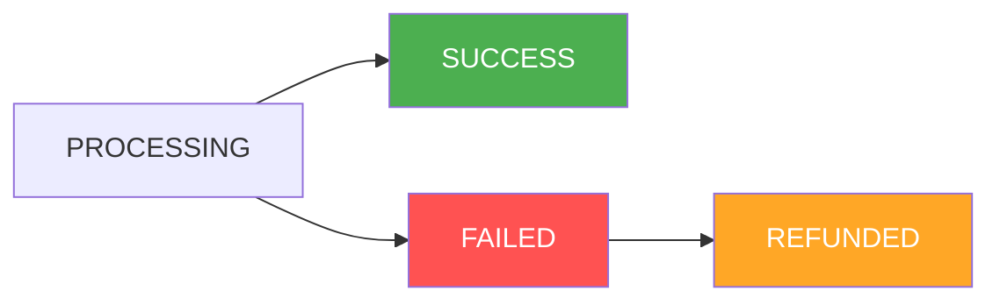
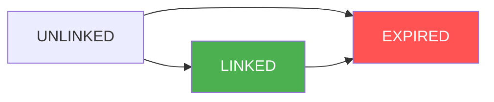
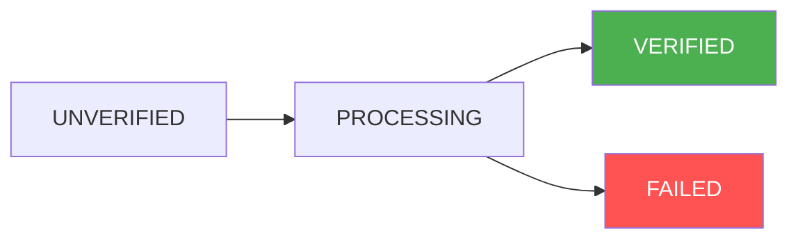

This page provides a comprehensive list of all possible status values and their transitions for payouts, quotations, and customers in our platform.

## Payout Status

### Available States
| State | Description |
|-------|-------------|
| `PROCESSING` | The payout is currently being processed through our system |
| `SUCCESS` | The payout has been successfully completed and funds have been transferred to the beneficiary |
| `FAILED` | The payout has failed due to issues like insufficient funds or invalid account details |
| `REFUNDED` | The payout amount has been successfully reversed and returned to the source account |

### Status Flow

## Quotation Status

### Available States
| State | Description |
|-------|-------------|
| `LINKED` | Quotation is associated with an order and ready for processing |
| `UNLINKED` | Quotation exists but is not associated with any order |
| `EXPIRED` | Quotation has exceeded its validity period and cannot be used |

### Status Flow

## Customer Status

### Available States
| State | Description |
|-------|-------------|
| `UNVERIFIED` | Initial state for newly created customer accounts |
| `PROCESSING` | Customer's KYC verification is under review |
| `VERIFIED` | Customer has completed KYC verification successfully |
| `FAILED` | Customer verification failed or account has been suspended |

### Status Flow

## Status Colors

The flow diagrams use the following color coding:
- **Green** (`#4CAF50`): Success/Completed State
- **Red** (`#FF5252`): Failed/Error State
- **Orange** (`#FFA726`): Reversed/Refunded State