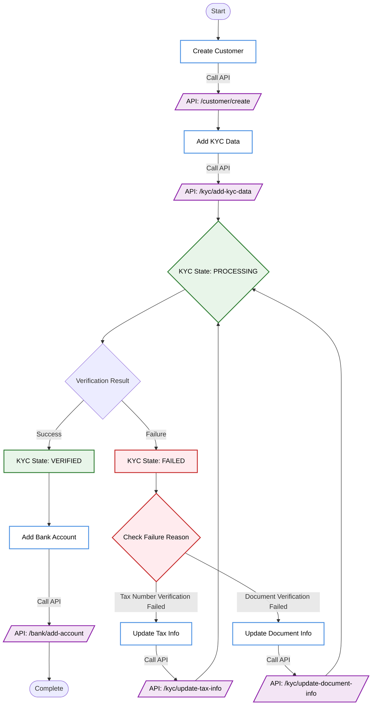
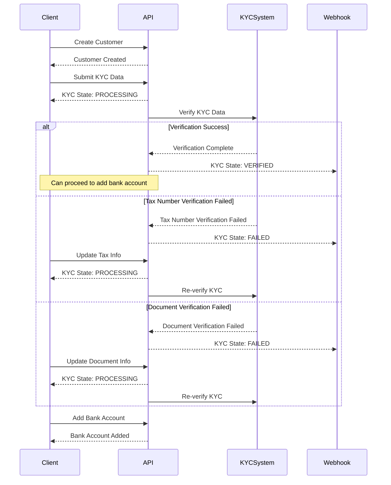

<Highlight>
  # KYC Integration Guide
</Highlight>

This guide provides a comprehensive walkthrough for integrating DollarPe's KYC verification system into your application.

<Note>
Before starting the integration:
- Ensure you have completed the [authentication setup](/api-reference/overview/authentication)
- Configure your [webhook endpoint](/api-reference/endpoint/webhook) for real-time KYC status updates
</Note>

## Integration Flow

### Visual Process Flow



### Sequence Diagram



## Integration Steps

### 1. Create Customer

First, create a customer using the [Create Customer](/api-reference/endpoint/customer/create) endpoint.

```javascript
POST /customer/create
{
  "full_name": "John Doe",
  "email": "john@example.com",
  "phone": "9910402972",
  "country": "IND",
  "type": "individual"
}
```

### 2. Submit KYC Data

Submit the customer's KYC information using [Add KYC Data](/api-reference/endpoint/kyc/add-kyc-data).

<Warning>
**Important**: 
- Ensure all document images are clear and legible
- Supported document types: AADHAAR, PASSPORT
- All required fields must be provided
</Warning>

```javascript
POST /kyc/add-kyc-data
{
  "customer_id": "customer_uuid",
  "full_name": "John Doe",
  "phone": "9910402972",
  "full_address": "123 Main St, City",
  "dob": "01-01-1990",
  "tax_number": "ABCDE1234F",
  "document_type": "AADHAAR",
  "document_front_image_url": "https://...",
  "document_back_image_url": "https://...",
  "document_details": {
    "document_number": "123456789012"
  }
}
```

### 3. Monitor KYC Status

### Option 1: Webhook Integration (Recommended)
Configure your [webhook endpoint](/api-reference/endpoint/webhook) to receive real-time KYC status updates:
- PROCESSING: Initial state after submission
- VERIFIED: KYC verification successful
- FAILED: Verification failed with specific reason

### Option 2: Status Polling
Check customer status using [Fetch Customer](/api-reference/endpoint/customer/{customer_id}).

### 4. Handle Verification Failures

#### Tax Number Verification Failed
If Tax Number verification fails, update tax information using [Update Tax Info](/api-reference/endpoint/kyc/update-tax-info):

```javascript
POST /kyc/update-tax-info
{
  "customer_id": "customer_uuid",
  "tax_number": "ABCDE1234F"
}
```

#### Document Verification Failed
If document verification fails, update document information using [Update Document Info](/api-reference/endpoint/kyc/update-document-info):

```javascript
POST /kyc/update-document-info
{
  "customer_id": "customer_uuid",
  "full_address": "Updated Address",
  "document_type": "AADHAAR",
  "document_front_image_url": "https://...",
  "document_back_image_url": "https://...",
  "document_details": {
    "document_number": "123456789012"
  }
}
```

### 5. Add Bank Account

Once KYC is verified, add bank account using [Add Bank Account](/api-reference/endpoint/bank/add-account):

```javascript
POST /bank/add-account
{
  "customer_id": "customer_uuid",
  "account_number": "1234567890",
  "ifsc": "ABCD0001234"
}
```

### 6. Begin Transactions

Once the customer is KYC verified and has at least one verified bank account, they can start transacting. At this point you can:

- Create payouts using the [Payout Integration Guide](/guides/payout)

<Note>
Ensure the customer's status is **VERIFIED** and they have at least one verified bank account before initiating transactions.
</Note>

## Best Practices

1. **Document Quality**
   - Submit high-resolution, clear images
   - Ensure all text is legible
   - Include all required document parts

2. **Error Handling**
   - Implement proper error handling for all API calls
   - Store transaction IDs for tracking
   - Log all webhook notifications

3. **Testing**
   - Test thoroughly in sandbox environment
   - Verify webhook integration
   - Test both success and failure scenarios

4. **Security**
   - Secure storage of sensitive information
   - Implement proper access controls
   - Use HTTPS for all API calls

<Note>
For technical support or integration assistance, contact our [support team](mailto:support@dollarpe.xyz)
</Note>