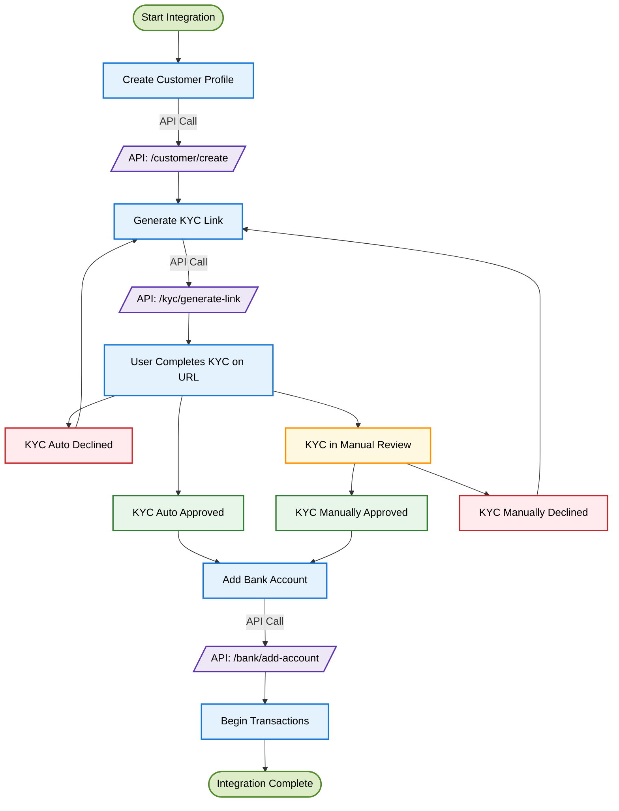

<Highlight>
  # KYC SDK
</Highlight>

## Overview

KYC SDK is DollarPe’s plug-and-play solution for platforms that want a seamless, compliant, and developer-light way to onboard users with full Know Your Customer (KYC) verification.

With the SDK, you don't need to build your own KYC workflows or manage the complexities of identity verification. Instead, you integrate our pre-built KYC flow directly into your app or website, and DollarPe handles the entire process — from document collection to verification and compliance checks.

This method is ideal for platforms that want to move fast, reduce integration effort, and ensure airtight compliance without managing any sensitive user data themselves.

By using the KYC SDK, you offer a user-friendly and secure onboarding experience while offloading the heavy lifting to DollarPe.

## Customer Journey in KYC SDK Flow

The diagram below outlines the full journey for a customer when using the KYC SDK. It includes every key stage — from initiating the SDK to receiving the final KYC verification result.



<Note> **Processing Time**: KYC verification typically takes 60 seconds to 120 minutes to complete. Design your user experience accordingly. </Note>

### Generate KYC Link

Once the customer profile is created, generate their KYC Link

<Warning>
**Document Requirements:**
- Aadhaar / Passport
- PAN Number
</Warning>

<Tabs>
  <Tab title="API Request">
  ```javascript
  POST /kyc/generate-link
  {
    "customer_id": "075986f3-282b-4555-bfcd-fad973e32596",
    "redirect_url": "https://..."
  }
  ```
  </Tab>
  
  <Tab title="Response">
  ```json
  {
    "status": true,
    "message": "Success",
    "data": {
        "customer_id": "075986f3-282b-4555-bfcd-fad973e32596",
        "url": "https://..."
    }
  }
  ```
  </Tab>
</Tabs>

<Tip>
Additionally, if you're collecting the KYC data yourself, you can also explore the [KYC Sharing](/guides/kyc/kyc-sharing) method.
</Tip>

### Verification Process

### Verification Process

The KYC SDK performs a 3-step verification to ensure regulatory compliance, fraud prevention, and a seamless onboarding experience. Here's how each step works:

---

#### Step 1: PAN Verification

**What the user sees:**

- The user is prompted to enter:
  - Full Name
  - Date of Birth
  - PAN Number

**What happens in the background:**

- A real-time PAN verification is performed using official government sources.
- The following checks are conducted:
  1. Validity of the entered PAN number.
  2. PAN category — it must belong to an **individual** (not a company/entity).
  3. Match between entered Name and DOB vs official PAN records.
  4. Aadhaar linkage status of the PAN.

<Note>
Only upon successful PAN verification does the flow proceed to Document Verification.
</Note>

---

#### Step 2: Document Verification

After PAN is verified, the user selects their preferred document type for identity proof:

##### Option A: Aadhaar

- **User Flow:** Mobile OTP-based authentication using DigiLocker.
- **Backend Checks:**
  - Official data is fetched directly via DigiLocker post-authentication.
  - No manual uploads are required.

##### Option B: Passport

- **User Flow:** The user is asked to upload:
  - Front page of the passport
  - Back page of the passport

- **Backend Checks:**
  - Document authenticity is checked using forgery detection.
  - OCR is performed to extract:
    - Name
    - Date of Birth
    - Passport Number
  - Cross-verification with government data (where available).

**Final Check in Step 2:**

- Name and DOB extracted from PAN are matched with those on the document (Aadhaar/Passport).

---

#### Step 3: Liveliness & Face Match

**What the user sees:**

- The SDK prompts the user to take a live selfie using their phone camera.

**What happens in the background:**

- **Liveliness Detection:**
  - Confirms the selfie is taken in real-time (not a static photo).
- **Face Match:**
  - The selfie is compared with the user photo extracted from Aadhaar or Passport.
  - Face matching uses biometric models to determine visual similarity.

---

#### ✅ Final Outcome

If the user successfully passes all three steps:

- **KYC Status:** `VERIFIED`
- The user is now eligible to proceed with linking a bank account and initiating transactions on DollarPe.

### Track Verification Status

After submitting KYC data, our system begins the verification process, which typically takes between 60 seconds to 120 minutes to complete. There are two ways to monitor this status:

<Note>
**Verification Timeframe**: Most verifications complete within 60 seconds to 120 minutes. You should communicate this expected timeline to your users to set proper expectations.
</Note>

#### Option A: Webhook Integration (Recommended)

Webhooks provide real-time updates about KYC status changes. Configure your webhook endpoint to receive these notifications:

```javascript
// Sample webhook payload
{
  "type": "CUSTOMER",
  "event": "FAILED",
  "id": "12348400-e29b-41d4-a716-446655440000",
  "timestamp": "2024-03-13T10:00:00Z",
  "metadata": {
    "failure_reason": "TAX_VERIFICATION_FAILED"
  }
}
```

#### Option B: Status Polling

If webhooks aren't feasible, you can periodically check the status using the customer endpoint:

<Tabs>
  <Tab title="API Request">
  ```javascript
  GET /customer/{customer_id}
  ```
  </Tab>
  
  <Tab title="Response">
  ```json
  {
    "status": true,
    "message": "Success",
    "data": {
        "id": "075986f3-282b-4555-bfcd-fad973e32596",
        "client_reference_id": "cus_12345abcde",
        "full_name": "JOHN DOE",
        "email": "john@example.com",
        "phone": "+919911002211",
        "country": "IND",
        "type": "INDIVIDUAL",
        "status": "UNVERIFIED",
        "failure_reason": null
    }
  }
  ```
  </Tab>
</Tabs>

<Tip>
If using the polling approach, we recommend checking no more frequently than once every 60 seconds to avoid API rate limits.
</Tip>

### Handle Verification Issues

If verification fails, you'll need to re-generate the KYC link and prompt the user to submit their KYC again.