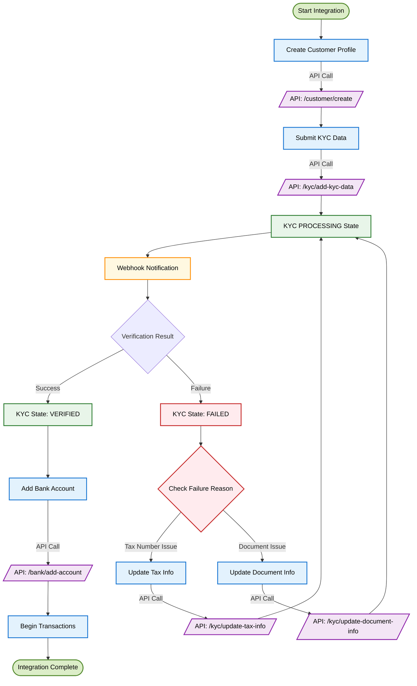

<Highlight>
  # KYC Sharing
</Highlight>

## Overview

KYC Sharing is a method where businesses independently perform Know Your Customer (KYC) verification on their users and then submit the verified information to DollarPe. Instead of relying on DollarPe’s SDK to manage the end-to-end process, businesses handle identity verification on their own and share the relevant data with us via API.

This method is ideal for platforms that already have KYC workflows in place and want to integrate with DollarPe without disrupting their existing compliance processes.

By using KYC Sharing, you retain full control over the user experience while still ensuring compliance with DollarPe’s verification standards and regulatory requirements.

## Customer Journey in KYC Sharing Flow

The diagram below outlines the end-to-end journey for a customer when using the KYC Sharing method. It covers every major step — from creating a customer profile to completing KYC and becoming eligible for transactions on DollarPe.

### Process Flow Diagram



<Note>
**Processing Time**: KYC verification typically takes 60 seconds to 120 minutes to complete. Design your user experience accordingly.
</Note>

### Submit KYC Information

Once the customer profile is created, collect and submit their KYC details using the `/kyc/add-kyc-data` API.

<Warning>
**Document Requirements:**
- Upload clear, high-resolution images
- Ensure all text on documents is legible
- Supported document types: AADHAAR, PASSPORT, VOTER_ID, DRIVING_LICENSE
- The customer's face must be clearly visible in the photo ID
</Warning>

<Tabs>
  <Tab title="API Request">
  
  ```json
  POST /kyc/add-kyc-data
  {
    "customer_id": "075986f3-282b-4555-bfcd-fad973e32596",
    "full_name": "John Doe",
    "phone": "9911002211",
    "full_address": "123 Main St, City",
    "dob": "01-01-1990",
    "registered_date": "01-01-2025",
    "tax_number": "ABCDE1234F",
    "document_type": "AADHAAR",
    "document_front_image_url": "https://...",
    "document_back_image_url": "https://...",
    "document_details": {
      "document_number": "123456789012",
      "additional_data": {}
    },
    "selfie_url": "https://...",
    "selfie_verification_status": true
  }
  ```
  </Tab> <Tab title="API Response">

  ```json
  {
    "status": true,
    "message": "Success",
    "data": {
        "customer_id": "075986f3-282b-4555-bfcd-fad973e32596",
        "status": "PROCESSING"
    }
  }
  ```
  </Tab>
</Tabs>

**Key Fields:**
- `customer_id`: ID received from Step 1
- `full_address`: Complete residential address
- `dob`: Date of birth (format: DD-MM-YYYY)
- `registered_date`: Date on which the user registered with centralized exchange
- `tax_number`: PAN as applicable
- `document_type`: Type of ID document submitted
- `document_front_image_url` & `document_back_image_url`: Secure URLs to uploaded document images
- `document_number`: Aadhaar Number or Passport's File Number based on document_type
- `selfie_url`: Secure URL to uploaded selfie image
- `selfie_verification_status`: Status of the client-side selfie verification

<Tip> For best results, use a secure file upload service to host image assets and pass their URLs to the API. Avoid using base64 strings for image uploads. </Tip>

### Verification Process

After KYC submission, we perform two core verification checks:

#### 1. PAN Verification

We validate the submitted `tax_number` (e.g., PAN) against official data sources and check -
- If the PAN number is valid and existing
- If the PAN number belongs to an individual user
- If the Name and DOB provided in the API matches with the Name and DOB fetched from official data sources
- If the PAN is linked to an Aadhaar number

If all the checks are passed, we mark the Tax Verification as completed and proceed with the document verification.

In case of failure, the KYC status moves to `FAILED` with failure reason of `TAX_VERIFICATION_FAILED`

#### 2. Document Verification

We validate the submitted `document_number` (e.g. Aadhaar Number, Passport File Number, etc.) against official data sources and check -
- The details in document matches with the details provided
- The documents are not expired and valid
- The document is not forged

### Track Verification Status

Once KYC data is submitted, the system begins automated verification, typically completing within 60 seconds to 120 minutes.

<Note> **Verification Timeframe**: Most verifications are completed within 5 to 120 minutes. Communicate this timeline to users to manage expectations. </Note>

#### Option A: Webhook Integration (Recommended)

Receive real-time KYC updates via webhooks. Your system should listen for events related to verification.

```json
// Sample webhook payload
{
  "type": "CUSTOMER",
  "event": "FAILED",
  "id": "12348400-e29b-41d4-a716-446655440000",
  "timestamp": "2024-03-13T10:00:00Z",
  "metadata": {
    "failure_reason": "TAX_VERIFICATION_FAILED"
  }
}
```

<Note>The event field can be `VERIFIED` or `FAILED` depending on the outcome. failure_reason will only be populated for failures.</Note>

#### Option B: Status Polling

If webhooks are not integrated, you can poll the `/customer/{customer_id}` endpoint periodically.

<Tabs>
    <Tab title="API Request">

    ```http
    GET /customer/{customer_id}
    ```

    </Tab> <Tab title="API Response">

    ```json
    {
        "status": true,
        "message": "Success",
        "data": {
            "id": "075986f3-282b-4555-bfcd-fad973e32596",
            "client_reference_id": "cus_12345abcde",
            "full_name": "JOHN DOE",
            "email": "john@example.com",
            "phone": "+919911002211",
            "country": "IND",
            "type": "INDIVIDUAL",
            "status": "UNVERIFIED",
            "failure_reason": null,
            "is_edd_verified": false
        }
    }
    ```

    </Tab>
</Tabs>

<Tip> If polling, avoid calling the status endpoint more than once every 60 seconds to stay within rate limits. </Tip>

### Handle Verification Issues

If verification fails, your system should help users correct and resubmit the problematic data.

#### Scenario A: PAN Verification Failed

Use the following API to resubmit a corrected tax number:

<Tabs>
    <Tab title="API Request">

    ```json
    POST /kyc/update-tax-info
    {
        "customer_id": "075986f3-282b-4555-bfcd-fad973e32596",
        "tax_number": "XYZAB1234C"
    }
    ```

    </Tab> <Tab title="API Response">

    ```json
    {
        "status": true,
        "message": "Success",
        "data": {
            "customer_id": "075986f3-282b-4555-bfcd-fad973e32596",
            "status": "PROCESSING"
        }
    }
    ```

    </Tab>
</Tabs>

#### Scenario B: Document Verification Failed

Use the document update API to re-upload clearer and correct images.

<Tabs>
    <Tab title="API Request">

    ```json
    POST /kyc/update-document-info
    {
        "customer_id": "075986f3-282b-4555-bfcd-fad973e32596",
        "full_address": "123 Main St, Apt 4B, City",
        "document_type": "AADHAAR",
        "document_front_image_url": "https://...",
        "document_back_image_url": "https://...",
        "document_details": {
            "document_number": "123456789012",
            "additional_data": {}
        }
    }
    ```

    </Tab> <Tab title="API Response">

    ```json
    {
        "status": true,
        "message": "Success",
        "data": {
            "customer_id": "075986f3-282b-4555-bfcd-fad973e32596",
            "status": "PROCESSING"
        }
    }
    ```
    </Tab>
</Tabs>

<Tip> Common reasons for verification failures: - Blurry or unclear images - Name mismatch across documents - Incorrect or outdated tax number - Expired identification documents </Tip>