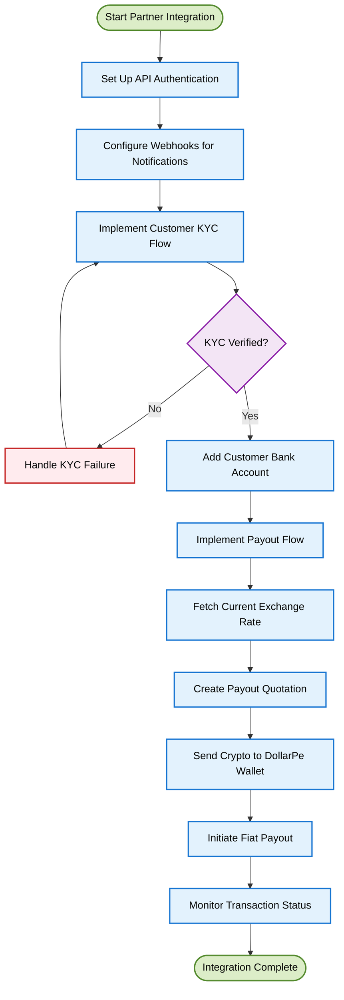

<Highlight>
  # DollarPe API Integration Overview
</Highlight>

## Welcome to DollarPe's API Platform

DollarPe provides a comprehensive suite of APIs that enable businesses to offer cryptocurrency onramp and offramp services to their customers. Our platform handles the complex aspects of cryptocurrency transactions, KYC verification, and banking operations, allowing you to focus on your core business while offering seamless crypto-fiat conversion solutions.

<Note>
**Partner Integration Benefits:**
- Offer crypto-to-fiat (offramp) and fiat-to-crypto (onramp) services without building blockchain infrastructure
- Leverage our compliant KYC and banking relationships
- Access competitive exchange rates and low transaction fees
- Provide your customers with fast, reliable conversion options
</Note>

## Integration Journey

As a DollarPe API partner, your integration journey involves these key steps:

<CardGroup cols={2}>
  <Card title="KYC Integration" icon="id-card" href="/guides/kyc">
    Implement our KYC verification flow to ensure regulatory compliance for your users.
  </Card>
  <Card title="Payout Integration" icon="money-bill-transfer" href="/guides/payout">
    Connect to our payout system to enable cryptocurrency-to-fiat transfers to bank accounts.
  </Card>
  <Card title="Stablecoins & Blockchains" icon="circle-dollar" href="/guides/support/stablecoins_and_blockchains">
    Understand our supported cryptocurrencies and blockchain networks for optimal implementation.
  </Card>
  <Card title="Fiat Payment Methods" icon="money-bill-transfer" href="/guides/support/fiatMethods">
    Explore the available fiat options you can offer to your customers.
  </Card>
</CardGroup>

## Partner Integration Flow

The typical partner integration flow follows these steps:



## Key Integration Components

### 1. API Authentication

Secure your API requests to our platform using our authentication system:

```javascript
// Example authentication header setup
const crypto = require('crypto');

/**
 * Generates authentication headers for DollarPe API requests.
 * @param {string} apiKey - Your partner API key.
 * @param {string} apiSecret - Your partner API secret.
 * @param {Object} [body={}] - The request body.
 * @returns {Object} - The headers object containing authentication details.
 */
const generateHeaders = (apiKey, apiSecret, body = {}) => {
  // Get current timestamp
  const timestamp = Math.floor(Date.now() / 1000);

  // Sort and stringify the body
  const sortedBody = JSON.stringify(body, Object.keys(body).sort());

  // Create message string
  const message = `${apiKey}|${timestamp}|${sortedBody}`;

  // Generate signature
  const signature = crypto
    .createHmac('sha256', apiSecret)
    .update(message)
    .digest('base64');

  return {
    'Content-Type': 'application/json',
    'X-API-KEY': apiKey,
    'X-TIMESTAMP': timestamp.toString(),
    'X-SIGNATURE': signature
  };
};
```

### 2. Customer KYC Integration

Implement our KYC flow to verify your customers' identities:

<Accordion title="KYC Implementation Steps">
1. Create a customer profile using [/customer/create](/api-reference/endpoint/customer/create)
2. Submit KYC documents and information using [/kyc/add-kyc-data](/api-reference/endpoint/kyc/add-kyc-data)
3. Monitor verification status via [/customer/{customer_id}](/api-reference/endpoint/customer/{customer_id}) or webhooks
4. Handle verification issues if needed using [/kyc/update-tax-info](/api-reference/endpoint/kyc/update-tax-info) or [/kyc/update-document-info](/api-reference/endpoint/kyc/update-document-info)
5. Add bank account details once verified using [/bank/add-account](/api-reference/endpoint/bank/add-account)

See our [KYC Integration Guide](/guides/kyc) for detailed implementation steps.
</Accordion>

### 3. Payout Service Integration

Connect to our payout system to enable cryptocurrency-to-fiat transfers:

<Accordion title="Payout Implementation Steps">
1. Fetch current exchange rates using [/payout/fetch-rate](/api-reference/endpoint/payout/fetch-rate)
2. Create a quotation using [/payout/quotation](/api-reference/endpoint/payout/quotation)
3. Send cryptocurrency to the provided DollarPe wallet address
4. Initiate the payout with transaction details using [/payout/initiate](/api-reference/endpoint/payout/initiate)
5. Monitor the transaction status using [/payout/{payout_id}](/api-reference/endpoint/payout/{payout_id}) or webhooks

See our [Payout Integration Guide](/guides/payout) for detailed implementation steps.
</Accordion>