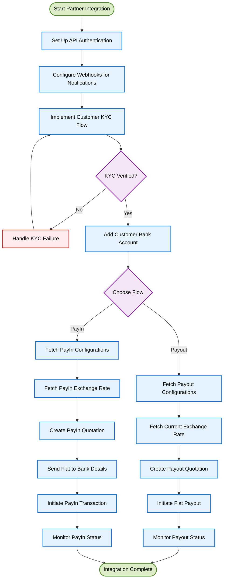

<Highlight># Quickstart</Highlight>

DollarPe provides a comprehensive suite of APIs that enable businesses to offer cryptocurrency onramp and offramp services to their customers. Our platform handles the complex aspects of cryptocurrency transactions, KYC verification, and banking operations, allowing you to focus on your core business while offering seamless crypto-fiat conversion solutions.

<Note>
  **Partner Integration Benefits:** - Offer crypto-to-fiat (offramp) and
  fiat-to-crypto (onramp) services without building blockchain infrastructure -
  Leverage our compliant KYC and banking relationships - Access competitive
  exchange rates and low transaction fees - Provide your customers with fast,
  reliable conversion options
</Note>

## Integration Journey

As a DollarPe API partner, your integration journey involves these key steps:

<CardGroup cols={2}>
  <Card
    title="Payout Integration"
    icon="money-bill-trend-up"
    href="/api-reference-other/integration-guides/payout-integration-guide"
  >
    Connect to our payout system to enable cryptocurrency-to-fiat transfers to
    bank accounts.
  </Card>
  <Card
    title="PayIn Integration"
    icon="bitcoin"
    href="/api-reference-exchange/integration-guides/payin-integration-guide"
  >
    Connect to our payin system to enable fiat-to-cryptocurrency transfers to
    wallet addresses.
  </Card>
  <Card
    title="KYC Integration"
    icon="user-shield"
    href="/api-reference-other/integration-guides/kyc-integration-guide"
  >
    Implement our KYC verification flow to ensure regulatory compliance for your
    users.
  </Card>
  <Card
    title="Supported Geographies"
    icon="earth-americas"
    href="/guides/support/geographies"
  >
    Explore the available fiat options you can offer to your customers.
  </Card>
  <Card
    title="Stablecoins & Blockchains"
    icon="coins"
    href="/guides/support/stablecoins_and_blockchains"
  >
    Understand our supported cryptocurrencies and blockchain networks for
    optimal implementation.
  </Card>
  <Card
    title="Fiat Payment Methods"
    icon="credit-card"
    href="/guides/support/fiatMethods"
  >
    Explore the available fiat options you can offer to your customers.
  </Card>
</CardGroup>

## Partner Integration Flow

The typical partner integration flow follows these steps:



## Key Integration Components

### 1. API Authentication

Secure your API requests to our platform using our authentication system:

```javascript
// Example authentication header setup
const crypto = require("crypto");

/**
 * Generates authentication headers for DollarPe API requests.
 * @param {string} apiKey - Your partner API key.
 * @param {string} apiSecret - Your partner API secret.
 * @param {Object} [body={}] - The request body.
 * @returns {Object} - The headers object containing authentication details.
 */
const generateHeaders = (apiKey, apiSecret, body = {}) => {
  // Get current timestamp
  const timestamp = Math.floor(Date.now() / 1000);

  // Sort and stringify the body
  const sortedBody = JSON.stringify(body, Object.keys(body).sort());

  // Create message string
  const message = `${apiKey}|${timestamp}|${sortedBody}`;

  // Generate signature
  const signature = crypto
    .createHmac("sha256", apiSecret)
    .update(message)
    .digest("base64");

  return {
    "Content-Type": "application/json",
    "X-API-KEY": apiKey,
    "X-TIMESTAMP": timestamp.toString(),
    "X-SIGNATURE": signature,
  };
};
```

### 2. Customer KYC Integration

Implement our KYC flow to verify your customers' identities:

<Accordion title="KYC Implementation Steps (Sharing based)">
1. Create a customer profile using [/customer/create](/api-reference-other/endpoint/customer/create)
2. Submit KYC documents and information using [/kyc/add-kyc-data](/api-reference-other/endpoint/kyc/add-kyc-data)
3. Monitor verification status via [/customer/{customer_id}](/api-reference-other/endpoint/customer/{customer_id}) or webhooks
4. Handle verification issues if needed using [/kyc/update-tax-info](/api-reference-other/endpoint/kyc/update-tax-info) or [/kyc/update-document-info](/api-reference-other/endpoint/kyc/update-document-info)
5. Add bank account details once verified using [/bank/create](/api-reference-other/endpoint/bank/create)

See our [KYC Integration Guide](/api-reference-other/integration-guides/kyc-integration-guide) for detailed implementation steps.

</Accordion>

<Accordion title="KYC Implementation Steps (SDK based)">
1. Create a customer profile using [/customer/create](/api-reference-other/endpoint/customer/create)
2. Generate a KYC link for the user [/kyc/generate-link](/api-reference-other/endpoint/kyc/generate-link)
3. Once the user has completed their [KYC Journey](/guides/kyc/kyc-sdk), they will be automatically redirected back to the redirect URL provided
4. Monitor verification status via [/customer/{customer_id}](/api-reference-other/endpoint/customer/{customer_id}) or webhooks
5. Re-attempt fresh KYC in case of issues or KYC failure by generating a new link
6. Add bank account details once verified using [/bank/create](/api-reference-other/endpoint/bank/create)

See our [KYC Integration Guide](/api-reference-other/integration-guides/kyc-integration-guide) for detailed implementation steps.

</Accordion>

### 3. PayIn Service Integration

Connect to our payin system to enable fiat-to-cryptocurrency transfers:

<Accordion title="PayIn Implementation Steps">
1. Fetch payin configurations using [/payin/configuration](/api-reference-exchange/endpoint/payin/configuration)
2. Fetch current exchange rates using [/payin/fetch-rate](/api-reference-exchange/endpoint/payin/fetch-rate)
3. Create a quotation using [/payin/quotation](/api-reference-exchange/endpoint/payin/quotation)
4. Send fiat amount to the provided bank details
5. Initiate the payin with transaction details using [/payin/initiate](/api-reference-exchange/endpoint/payin/initiate)
6. Monitor the payin status using [/payin/payin_id](/api-reference-exchange/endpoint/payin/{payin_id}) or webhooks

See our [PayIn Integration Guide](/api-reference-exchange/integration-guides/payin-integration-guide) for detailed implementation steps.

</Accordion>

### 4. Payout Service Integration

Connect to our payout system to enable cryptocurrency-to-fiat transfers:

<Accordion title="Payout Implementation Steps">
1. Fetch payout configurations using [/payout/configuration](/api-reference-other/endpoint/payout/configuration)
2. Fetch current exchange rates using [/payout/fetch-rate](/api-reference-other/endpoint/payout/fetch-rate)
3. Create a quotation using [/payout/quotation](/api-reference-other/endpoint/payout/quotation)
4. Initiate the payout with transaction details using [/payout/initiate](/api-reference-other/endpoint/payout/initiate)
5. Monitor the payout status using [/payout/payout_id](/api-reference-other/endpoint/payout/{payout_id}) or webhooks

See our [Payout Integration Guide](/api-reference-other/integration-guides/payout-integration-guide) for detailed implementation steps.

</Accordion>
