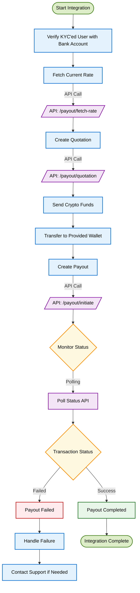
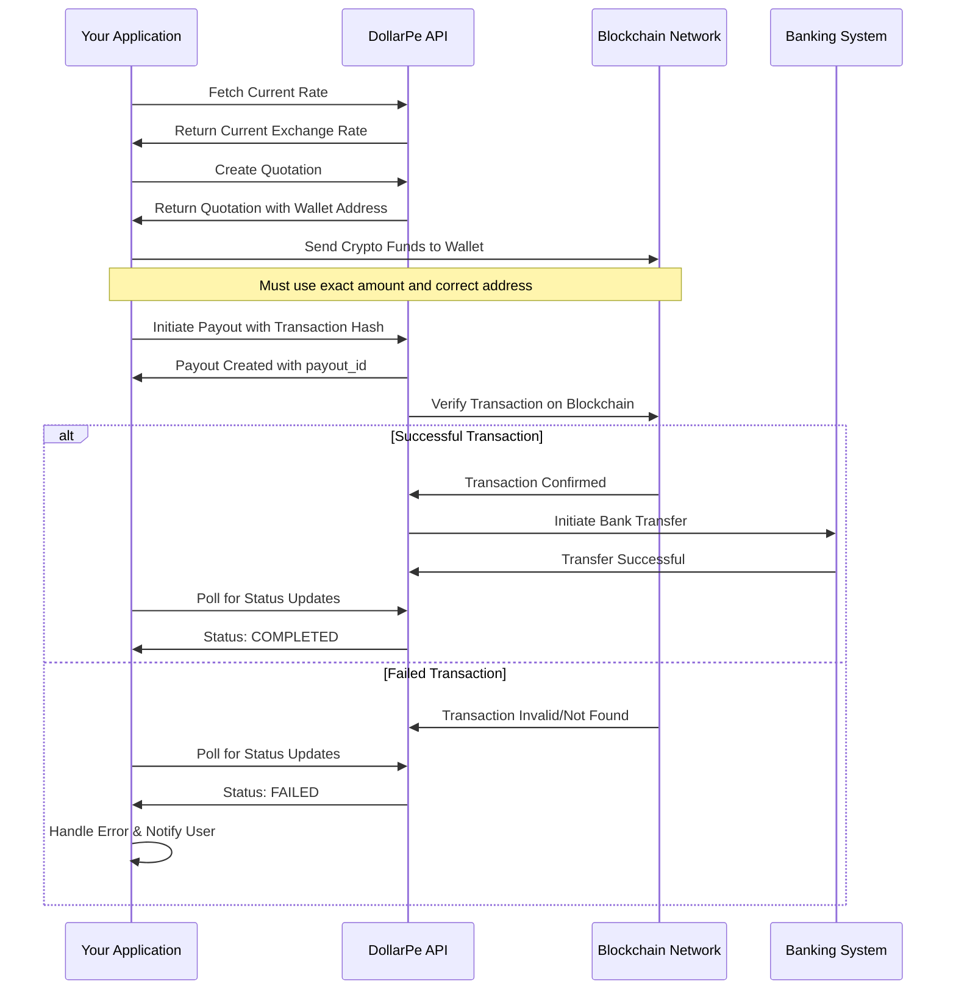

<Highlight>
  # Payout Integration Guide
</Highlight>

## What are Payouts and Why They Matter

Payouts allow your application to transfer funds to your customers' bank accounts using cryptocurrency as the funding source. This guide will walk you through integrating DollarPe's Payout system into your application, whether you're a developer or a business owner.

<Note>
**Before You Begin:**
- Ensure you have completed the [authentication setup](/api-reference/overview/authentication)
- Configure your [webhook endpoint](/api-reference/endpoint/webhook) for real-time updates
- Review [supported stablecoins and blockchains](/guides/support/stablecoins_and_blockchains)
- Verify your users have completed KYC and have at least one verified bank account
</Note>

## Integration at a Glance

The Payout integration follows these main steps:

1. Fetch current exchange rates
2. Create a quotation
3. Send cryptocurrency to the provided wallet address
4. Initiate the payout with transaction details
5. Monitor the transaction status
6. Handle transaction completion

## Visual Integration Flow

### Process Flow Diagram



<Note>
**Important Timing**: Quotations are typically valid for 5 minutes. Send funds and initiate the payout before the quotation expiry time.
</Note>

### Sequence Diagram: Detailed Process Flow



## Step-by-Step Integration Guide

### Step 1: Fetch Current Exchange Rate

First, retrieve the current exchange rate to provide accurate pricing information to your users.

<Tabs>
  <Tab title="API Request">
  ```javascript
  POST /payout/fetch-rate
  {
    "asset": "USDT",
    "network": "BSC",
    "amount": 100.5
  }
  ```
  </Tab>
  
  <Tab title="Response">
  ```json
  {
    "status": true,
    "message": "Success",
    "data": {
      "asset": "USDT",
      "network": "BSC",
      "fiat": "INR",
      "rate": 87.2
    }
  }
  ```
  </Tab>
</Tabs>

**Key Fields:**
- `asset`: Cryptocurrency to be used (e.g., "USDT", "USDC")
- `network`: Blockchain network (e.g., "BSC", "POLYGON", "TRON")
- `amount`: Amount in cryptocurrency
- `rate`: Current exchange rate (amount of fiat per 1 unit of crypto)

<Tip>
Rates fluctuate constantly based on market conditions. We recommend fetching a new rate before each transaction to ensure accuracy.
</Tip>

### Step 2: Create a Quotation

After getting the current rate, create a quotation to lock in the rate and receive the wallet address for sending funds.

<Warning>
**CRITICAL SECURITY NOTICE**: 
- You MUST whitelist the wallet address provided in the quotation response
- You MUST send funds ONLY through this whitelisted wallet address
- Funds sent from non-whitelisted addresses or to incorrect addresses WILL BE PERMANENTLY LOST
- Only use supported asset and network combinations
- Double-check all details before proceeding
</Warning>

<Tabs>
  <Tab title="API Request">
  ```javascript
  POST /payout/quotation
  {
    "asset": "usdt",
    "fiat": "inr",
    "network": "bsc",
    "sending_amount": "51",
    "customer_id": "def8b740-99f9-4cba-bc9e-99de57e927b4"
  }
  ```
  </Tab>
  
  <Tab title="Response">
  ```json
  {
    "status": true,
    "message": "Success",
    "data": {
      "id": "2e104290-07c8-49f1-a5ca-0d27f0078f8a",
      "asset": "USDT",
      "network": "BSC",
      "fiat": "INR",
      "sending_amount": 51,
      "rate": 82.5,
      "receiving_amount": 4144.6,
      "fees": {
        "dollarpe_fees": 21.04,
        "tds_fees": 41.86
      },
      "wallet_address": "0x2EAf174Bf1CD624eD63e3C8c74Dd66B66e5cb273",
      "created_at": "2025-03-08T07:31:11.163005Z",
      "expiry_time": "2025-03-08T07:36:11.163005Z"
    }
  }
  ```
  </Tab>
</Tabs>

**Key Fields:**
- `asset`: Cryptocurrency to be used
- `network`: Blockchain network for the transaction
- `fiat`: Fiat currency to receive (e.g., "INR" for Indian Rupee)
- `sending_amount`: Amount in cryptocurrency
- `customer_id`: ID of the KYC-verified customer
- `wallet_address`: Address to send funds to (MUST be whitelisted)
- `expiry_time`: Time until the quotation expires

<Note>
The quotation is valid for only 5 minutes as indicated by the `expiry_time`. You must complete your transaction before this time expires.
</Note>

### Step 3: Send Crypto Funds

Once you have the quotation, send the cryptocurrency to the provided wallet address:

<Warning>
**IMPORTANT SAFEGUARDS**: 
- You MUST whitelist and use ONLY the wallet address provided in the quotation
- Send EXACTLY the amount specified in the quotation
- Ensure you select the CORRECT blockchain network
- Complete the transfer BEFORE the quotation expires
- Failure to follow these guidelines will result in PERMANENT LOSS OF FUNDS
</Warning>

This step happens outside our API, using your preferred cryptocurrency wallet or exchange. Ensure you:

1. Whitelist the wallet address exactly as provided in the quotation
2. Double-check the network selection matches what you specified in the quotation
3. Send the exact amount specified in the `sending_amount` field
4. Obtain the transaction hash (txid) after sending
5. Verify the transaction is confirmed on the blockchain

<Tip>
For large transactions, we recommend doing a small test transaction first to verify all details are correct.
</Tip>

### Step 4: Initiate the Payout

After sending the funds, create a payout request with the transaction details:

<Tabs>
  <Tab title="API Request">
  ```javascript
  POST /payout/initiate
  {
    "quotation_id": "2e104290-07c8-49f1-a5ca-0d27f0078f8a",
    "customer_id": "def8b740-99f9-4cba-bc9e-99de57e927b4",
    "client_reference_id": "testUser123",
    "bank_id": "e75f62f0-db9e-4904-8103-d6f14f67f5dc",
    "transaction_hash": "0x9b34a0e4897cd834847d8bbb8814eba72149f914785c406884d14f8108bc"
  }
  ```
  </Tab>
  
  <Tab title="Response">
  ```json
  {
    "status": true,
    "message": "Success",
    "data": {
      "id": "5b75096f-de8d-44b4-9230-d94e6948abb6",
      "quotation_id": "2e104290-07c8-49f1-a5ca-0d27f0078f8a",
      "customer_id": "def8b740-99f9-4cba-bc9e-99de57e927b4",
      "client_reference_id": "testUser123",
      "bank_id": "e75f62f0-db9e-4904-8103-d6f14f67f5dc",
      "asset": "USDT",
      "network": "BSC",
      "fiat": "INR",
      "rate": 82.5,
      "sending_amount": 51,
      "receiving_amount": 4144.6,
      "fees": {
        "dollarpe_fees": 21.04,
        "tds_fees": 41.86
      },
      "memo": "123456",
      "wallet_address": "0x2EAf174Bf1CD624eD63e3C8c74Dd66B66e5cb273",
      "transaction_hash": "0x9b34a0e4897cd834847d8bbb8814eba72149f914785c406884d14f8108bc",
      "created_at": "2025-03-08T07:31:24.770179Z",
      "status": "PROCESSING"
    }
  }
  ```
  </Tab>
</Tabs>

**Key Fields:**
- `quotation_id`: ID received from Step 2
- `customer_id`: ID of the KYC-verified customer
- `client_reference_id`: Your internal reference ID for tracking (optional)
- `bank_id`: ID of the verified bank account
- `transaction_hash`: The blockchain transaction ID/hash from Step 3
- `status`: Current status of the payout

<Note>
Most payouts are processed within 30-60 minutes, but can take up to 24 hours during high volume periods or in case of bank processing delays.
</Note>

### Step 5: Monitor Transaction Status

After initiating the payout, you need to track its status by polling the API:

<Tabs>
  <Tab title="API Request">
  ```javascript
  GET /payout/{payout_id}
  ```
  </Tab>
  
  <Tab title="Response">
  ```json
  {
    "status": true,
    "message": "Success",
    "data": {
      "id": "08441dd3-8cc0-405c-932b-7fdbc8894f66",
      "quotation_d": "08441dd3-8cc0-405c-932b-7fdbc8894f66",
      "customer_d": "dfd8db74-2fbb-46d1-9a93-b90f156e13b4",
      "status": "CRYPTO_RECEIVED",
      "client_reference_d": "testUser123",
      "bank_id": "e75f62f0-db9e-4904-8103-d6f14f67f5dc",
      "asset": "USDT",
      "network": "POLYGON",
      "fiat": "INR",
      "sending_amount": "10",
      "rate": "89.4",
      "receiveing_amount": "870",
      "fees": {
        "tds_fees": "",
        "dollarpe_fees": ""
      },
      "transaction_hash": "0x9b34a0e4897cd834847d8bbb8814eba72149f914785c406684d4f809ac",
      "wallet_address": "0x71C7656EC7ab88b098def1B5f6d8976F",
      "created_at": "2025-02-11T01:30:08.000Z",
      "updated_at": "2025-02-11T01:30:08.000Z"
    }
  }
  ```
  </Tab>
</Tabs>

<Tip>
If using the polling approach, we recommend checking no more frequently than once every 5 minutes to avoid API rate limits.
</Tip>

**Possible Status Values:**
- `PROCESSING`: Initial state, waiting for crypto confirmation
- `CRYPTO_RECEIVED`: Cryptocurrency has been received and verified
- `BANK_TRANSFER_INITIATED`: Fiat transfer to bank has been initiated
- `COMPLETED`: Payout has been successfully completed
- `FAILED`: Payout has failed for some reason

### Step 6: Handle Transaction Completion

#### Successful Transactions

When a payout is completed successfully:

1. Update your internal records with the transaction details
2. Notify your user that the funds have been sent to their bank account
3. Provide the bank reference number for their records (if available)
4. Store the transaction details for future reference and customer support

<Warning>
If your transaction fails due to sending funds to the wrong address or network, recovery may not be possible. Always double-check these details before sending.
</Warning>

## Testing Your Integration

### Sandbox Environment

Before going live, test your integration thoroughly in our sandbox environment:

1. Use the base URL: `https://sandbox-api.dollarpe.xyz`
2. Follow the same steps as production
3. Test both successful and failed transaction scenarios

<Tip>
In the sandbox environment, you can simulate different failure scenarios by using specific test values. Refer to our [Sandbox Testing Guide](/guides/sandbox-testing) for details.
</Tip>

## Common Issues & Solutions

<Accordion title="Rate Changed Between Quotation and Transaction">
Exchange rates are locked once you create a quotation. However, if your quotation expires, you'll need to create a new one with the current rate. Always check the expiry time and complete your transaction before it expires.
</Accordion>

<Accordion title="Transaction Not Being Detected">
Ensure you're using the correct transaction hash and that the transaction has sufficient blockchain confirmations. Most networks require at least 6-12 confirmations before a transaction is considered final.
</Accordion>

<Accordion title="Funds Not Received by Customer">
If the customer reports not receiving funds, verify the bank account details and check the transaction status. If the status shows as completed but funds haven't arrived, there might be a delay in the banking system.
</Accordion>

<Accordion title="Payout Taking Too Long">
Most payouts complete within 30-60 minutes, but can take up to 24 hours during high volume periods or bank processing delays. If a payout is pending for more than 24 hours, contact our support team.
</Accordion>

## Best Practices for Smooth Payouts

1. **Wallet Address Security**
   - Always whitelist the wallet address provided in the quotation
   - Never send funds from non-whitelisted addresses
   - Implement strict validation checks before sending crypto

2. **Provide Clear Instructions to Users**
   - Explain the process and expected timeframes
   - Set expectations about processing times
   - Give guidance on what to do if they don't receive funds

3. **Implement Proper Error Handling**
   - Display user-friendly error messages
   - Provide specific guidance on how to correct issues
   - Keep track of transaction IDs for troubleshooting

4. **Security Best Practices**
   - Always verify wallet addresses before sending
   - Implement multi-factor authentication for large transfers
   - Keep transaction logs for audit purposes

5. **Optimize for Mobile Users**
   - Design mobile-friendly transaction forms
   - Provide QR codes for wallet addresses
   - Test the flow on multiple device types

<Tip>
Create a transaction history dashboard for users to track their payouts, including status updates, transaction details, and bank references. This reduces support inquiries and improves user experience.
</Tip>

## Getting Help

If you encounter any issues with your payout integration:

- Check our [API documentation](/api-reference) for detailed endpoint information
- Visit the [Troubleshooting Guide](/guides/troubleshooting) for common solutions
- Contact our [support team](mailto:support@dollarpe.xyz) with your customer_id and transaction logs

<Note>
Our support team is available 24/7 to help with integration issues. For urgent matters, use the in-app chat or call our technical support hotline.
</Note>