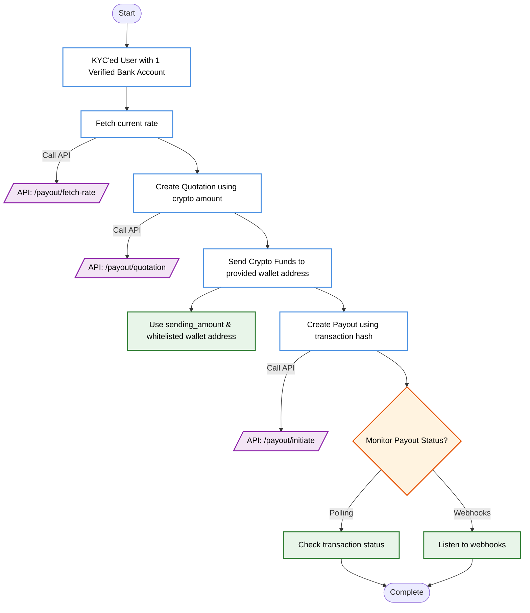

<Highlight>
  # Payout Intergration Guide
</Highlight>

This guide serves as a comprehensive walkthrough for partners to integrate the API's for transaction processes using DollarPe APIs.

<Note>
Before starting the integration:
- Ensure you have completed the [authentication setup](/api-reference/overview/authentication)
- Configure your [webhook endpoint](/api-reference/endpoint/webhook) for real-time updates
- Review [supported stablecoins and blockchains](/guides/support/stablecoins_and_blockchains)
</Note>

## Integration Flow

### Visual Process Flow



### Sequence Diagram

```mermaid
sequenceDiagram
    %% Participants with Colors
    participant User as 🧑‍💻 User
    participant System as ⚙️ System
    participant FetchRateAPI as 🔵 API: /payout/fetch-rate/
    participant QuoteAPI as 🟣 API: /payout/quotation/
    participant PayoutAPI as 🟠 API: /payout/initiate/
    participant Webhook as 🔔 Webhook Listener

    %% Process Flow with Color Highlights
    User ->> System: 🟢 Start
    System ->> System: 🔍 Check if KYC'ed with 1 verified bank account
    System ->> FetchRateAPI: 📡 Fetch current rate
    FetchRateAPI -->> System: 🔄 Return rate

    System ->> QuoteAPI: ✍️ Create Quotation using crypto amount
    QuoteAPI -->> System: 📩 Return quote details

    System ->> System: 🚀 Send Crypto Funds to wallet
    System ->> System: 💰 Use sending_amount & whitelisted wallet address

    System ->> PayoutAPI: 📝 Create Payout using transaction hash
    PayoutAPI -->> System: 🔄 Return payout details

    alt Monitor Payout Status
        System ->> System: 🔄 Poll transaction status
    else Webhook Notification
        Webhook -->> System: 🔔 Receive status update
    end

    System ->> User: ✅ Complete Transaction
```



## Integration Steps

### 1. Fetch Current Exchange Rate

First, retrieve the current exchange rate using the [Fetch Rate](/api-reference/endpoint/payout/fetch-rate). This step is crucial for obtaining real-time pricing information.

```javascript
POST /payout/fetch-rate
{
  "asset": "USDT",
  "network": "BSC",
  "amount": 87.5
}
```

The response includes current rate.

### 2. Generate Quotation

Create a quotation using the [Create Quotation](/api-reference/endpoint/payout/quotation). 

<Warning>
**Critical Security Notice**: 
- Only use supported [asset and network combinations](/guides/support/stablecoins_and_blockchains)
- **Funds sent to unsupported pairs or incorrect addresses will be permanently lost**
</Warning>

```javascript
POST /payout/quotation
{
  "asset": "USDT",
  "network": "BSC",
  "fiat": "INR",
  "sending_amount": "100",
  "customer_id": "customer_uuid"
}
```

The response includes:
- `wallet_address`: Destination for crypto transfer
- `quotation_id`: Unique identifier for the quote
- `expiry_time`: Validity period for the quotation

### 3. Send Crypto Funds

<Warning>
**Important**: 
- Send **exact** amount specified in quotation.
- Use **only** the whitelisted wallet address to send funds.
- Send funds **only** to the wallet address returned in quotation response.
- Complete transfer before quotation expiry.
</Warning>

Transfer the crypto amount to the wallet address received in the quotation response. Ensure you:
1. Verify the wallet address
2. Double-check the network selection
3. Confirm the exact amount

### 4. Initiate Payout

Once funds are sent, create a payout using the [Create Payout](/api-reference/endpoint/payout/initiate).

```javascript
POST /payout/initiate
{
  "quotation_id": "quotation_uuid",
  "customer_id": "customer_uuid",
  "bank_id": "bank_account_uuid",
  "transaction_hash": "0x..."
}
```

The response includes a `payout_id` for tracking the transaction.

### 5. Monitor Transaction Status

### Option 1: Webhook Integration (Recommended)
Configure your [webhook endpoint](/api-reference/endpoint/webhook) to receive real-time status updates. Events include:
- Transaction initiation
- Crypto receipt confirmation
- Fiat transfer status
- Completion/Failure notifications

### Option 2: Status Polling
Use the [Fetch Payout API](/api-reference/endpoint/payout/{payout_id}) to check transaction status:

```javascript
GET /payout/{payout_id}
```

### 6. Handle Transaction Completion

### Successful Transactions
When status update indicates success:
1. Verify the received amount matches expected value
2. Update your internal systems
3. Notify the user of successful completion

### Failed Transactions
If the transaction fails:
1. Check the error details in the status response
2. Contact [support](mailto:support@dollarpe.xyz) if needed
3. Notify the user and provide next steps

## Additional Resources

### Supported Payment Methods

Review our supported [fiat payment methods](/guides/support/fiatMethods) for:
- Processing times
- Amount limits
- Available transfer types

### Error Handling

Implement proper error handling for:
- Rate fluctuations
- Network timeouts
- Invalid parameters
- Expired quotations
- Failed transactions

### Best Practices

1. Always verify asset-network combinations before transactions
2. Implement robust error handling
3. Set up automated monitoring for webhook endpoints
4. Maintain transaction logs for reconciliation
5. Test thoroughly in [sandbox environment](/api-reference/overview/introduction#base-urls) first

<Note>
For technical support or integration assistance, contact our [support team](mailto:support@dollarpe.xyz)
</Note>